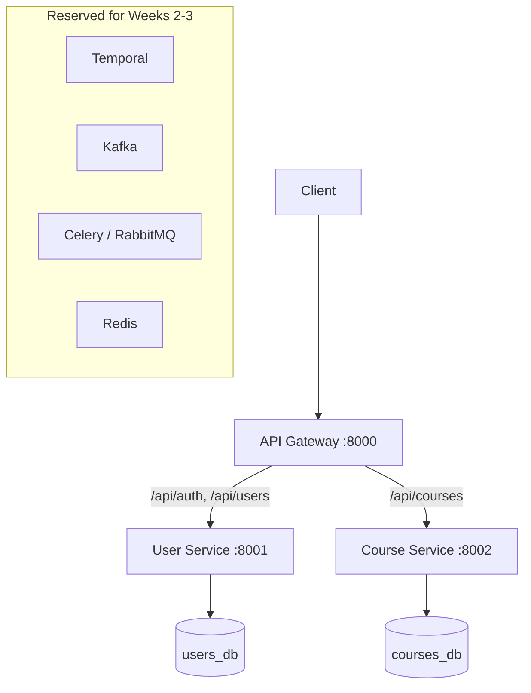

# SmartCourse — Part A (Backend)

An intelligent, large-scale course delivery platform. This repository contains the
**Part A** backend: a reliable, scalable, event-driven foundation for course
management, publishing, enrollment, and analytics. Part B (the GenAI layer) builds
on top of it later.

This is a **microservices** system built in **Python / FastAPI**.

> Status: **Week 1 — Foundation + Core Services.** User & course management,
> role handling, and a runnable local environment. Weeks 2–3 add Temporal
> workflows, Kafka events, Celery workers, and observability.

## Architecture (Week 1)



Each service owns its **own database**. A course stores `instructor_id` as a
plain UUID — deliberately *not* a cross-database foreign key, because the user
record lives in another service. Services trust each other through a
**shared-secret JWT**: the user service issues tokens, and every service verifies
them locally without a network round-trip.

## Tech stack

| Concern            | Choice (Week 1)                     | Planned (Weeks 2–3)          |
| ------------------ | ----------------------------------- | ---------------------------- |
| Language / API     | Python 3.12, FastAPI                | —                            |
| Data store         | PostgreSQL (one DB per service)     | + Redis, NoSQL where needed  |
| Auth               | JWT (PyJWT), bcrypt password hashing| —                            |
| Workflows          | —                                   | Temporal                     |
| Events / async     | —                                   | Kafka + Schema Registry, Celery/RabbitMQ |
| Observability      | Structured logs                     | Prometheus, Grafana, Jaeger, OpenTelemetry |
| Packaging / run    | Docker, Docker Compose              | —                            |

## Repository layout

```
smartcourse/
├── docker-compose.yml         # one command to run everything locally
├── .env.example               # copy to .env
├── docs/
│   ├── PRD.md                 # product requirements + traceability
│   └── technical-design.md    # services, data flow, decisions, tradeoffs
└── services/
    ├── api-gateway/           # single entry point, routes to services
    ├── user-service/          # auth, users, roles  → users_db
    └── course-service/        # course CRUD          → courses_db
```

Every service follows the same internal layering: `api/` (HTTP) → `services/`
(business logic) → `models/` (ORM) with `schemas/` (Pydantic DTOs) and `core/`
(config, DB session, security).

## Running locally

Prerequisites: Docker and Docker Compose.

```bash
cp .env.example .env          # then edit JWT_SECRET if you like
docker compose up --build
```

Services come up at:

| Service        | URL                          | API docs (Swagger)              |
| -------------- | ---------------------------- | ------------------------------- |
| API Gateway    | http://localhost:8000        | —                               |
| User Service   | http://localhost:8001        | http://localhost:8001/docs      |
| Course Service | http://localhost:8002        | http://localhost:8002/docs      |

All application traffic can go through the gateway under the `/api` prefix
(e.g. `POST http://localhost:8000/api/auth/register`). Services are also
directly reachable on their own ports, which is handy while developing.

## API overview

Through the gateway (prefix everything with `http://localhost:8000/api`), or hit
services directly on 8001 / 8002.

User service:

| Method | Path              | Auth        | Purpose                          |
| ------ | ----------------- | ----------- | -------------------------------- |
| POST   | `/auth/register`  | public      | Create a user (role: student or instructor) |
| POST   | `/auth/login`     | public      | Exchange credentials for a JWT   |
| GET    | `/users/me`       | any user    | Current user's profile           |
| GET    | `/users/{id}`     | any user    | Look up a user                   |
| GET    | `/users`          | any user    | List users (paginated)           |
| PATCH  | `/users/{id}`     | self        | Update name / active flag        |

Course service:

| Method | Path             | Auth              | Purpose                       |
| ------ | ---------------- | ----------------- | ----------------------------- |
| POST   | `/courses`       | instructor        | Create a course (starts as draft) |
| GET    | `/courses`       | any user          | List/filter courses           |
| GET    | `/courses/{id}`  | any user          | Get one course                |
| PATCH  | `/courses/{id}`  | owner (instructor)| Update course, change status  |
| DELETE | `/courses/{id}`  | owner (instructor)| Delete a course               |

### Quick smoke test

```bash
# 1. Register an instructor
curl -s -X POST localhost:8000/api/auth/register \
  -H 'Content-Type: application/json' \
  -d '{"email":"teacher@edu.com","password":"password123","full_name":"Ada","role":"instructor"}'

# 2. Log in, capture the token
TOKEN=$(curl -s -X POST localhost:8000/api/auth/login \
  -H 'Content-Type: application/json' \
  -d '{"email":"teacher@edu.com","password":"password123"}' | python3 -c "import sys,json;print(json.load(sys.stdin)['access_token'])")

# 3. Create a course (instructor-only)
curl -s -X POST localhost:8000/api/courses \
  -H "Authorization: Bearer $TOKEN" -H 'Content-Type: application/json' \
  -d '{"title":"Intro to Distributed Systems","description":"Week 1 demo"}'

# 4. List courses
curl -s localhost:8000/api/courses -H "Authorization: Bearer $TOKEN"
```

## Tests

```bash
cd services/user-service && pip install -r requirements.txt && pytest
cd services/course-service && pip install -r requirements.txt && pytest
```

The included tests are no-database smoke tests for the health endpoints. Broader
service-layer tests come as the logic grows in Weeks 2–3.

## Documentation

- [`docs/PRD.md`](docs/PRD.md) — use-cases, requirements, milestones, traceability
- [`docs/technical-design.md`](docs/technical-design.md) — service breakdown, data
  flow, key design decisions, assumptions and tradeoffs
