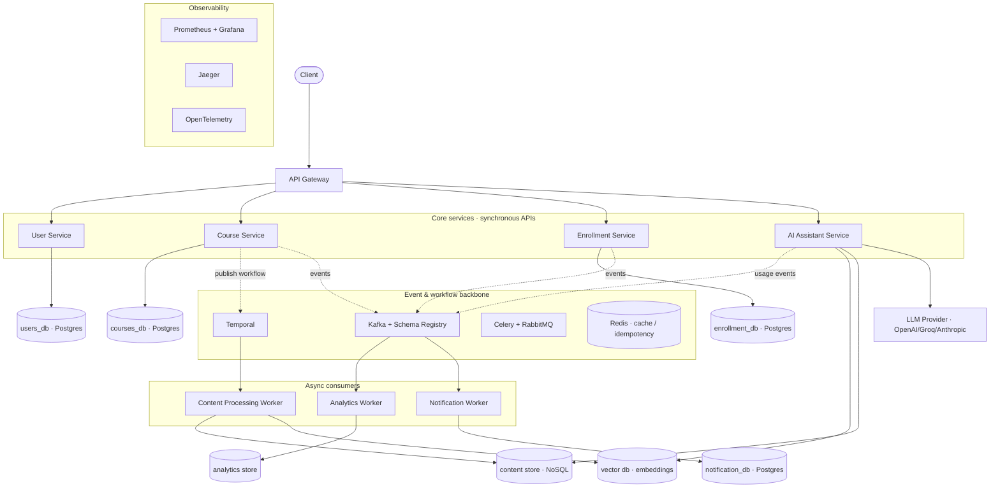
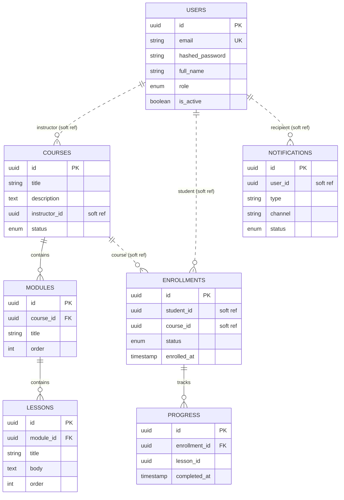
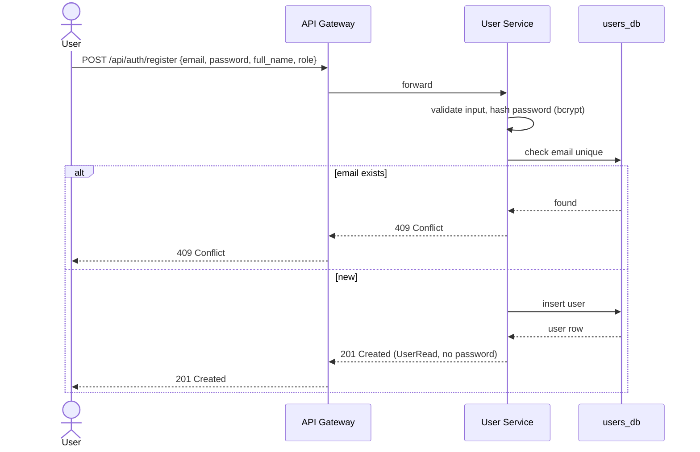
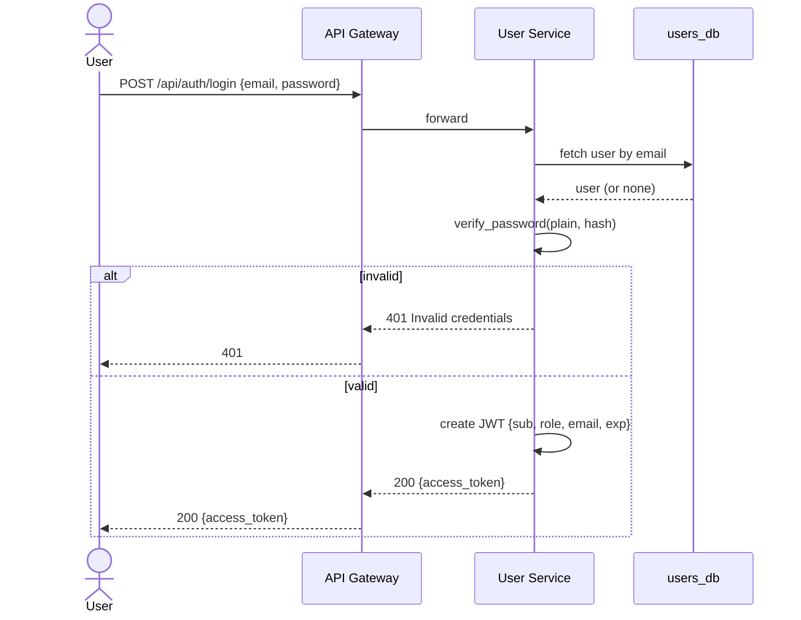
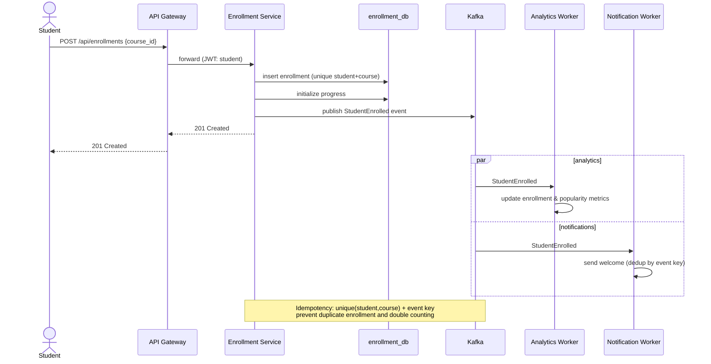
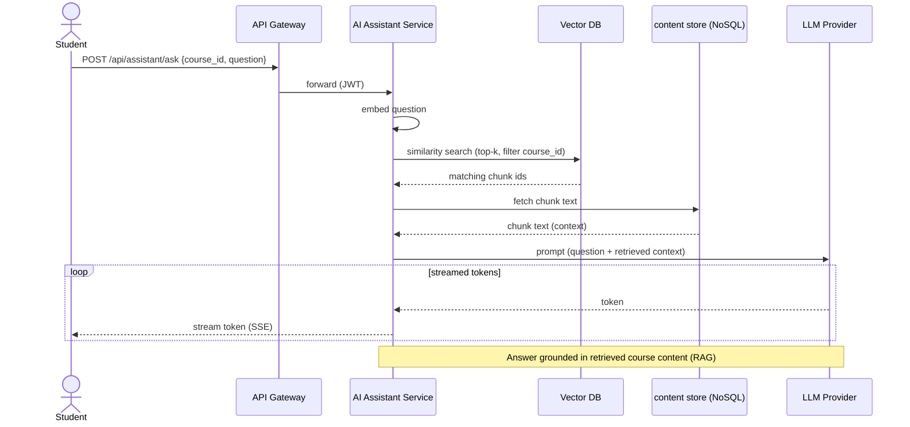

# SmartCourse — System Design (Complete Project)

Scope of this document: the **entire SmartCourse system** — the Part A backend
(course/user management, publishing, enrollment, analytics, notifications) **and**
the Part B GenAI layer (intelligent learning assistant). Architecture style is
**microservices**, implemented in Python (FastAPI).

**Status markers.** The project is delivered iteratively over five weeks, so every
element is tagged with the phase it belongs to:

- **[BUILT · W1]** — designed and implemented.
- **[PLANNED · W2] … [PLANNED · W5]** — target design; built in that week. Design
  detail here is intent, not a claim of implementation.

Week mapping: W1 foundation & core services · W2 enrollment + publishing workflow ·
W3 events + analytics + notifications + observability · W4 data prep + retrieval
(GenAI) · W5 AI assistant + streaming.

---

## 1. Problem & goals

SmartCourse must serve tens of thousands of learners with spikes during course
launches. The brief identifies five problems the design must solve: slow/manual
publishing; scattered, inconsistent data across course/progress/analytics; high
latency under load; unreliable background processing; and rich interaction data
left underutilized. Part B adds a sixth: students need contextual answers from
course material, and instructors need auto-generated summaries/quizzes — with
long-running generation that must not block other users.

Every decision below traces back to these goals: **scalability, consistency,
reliability, and (for Part B) responsive intelligent interactions.**

---

## 2. Design approach & principles

- **Microservices.** Independent, separately deployable services rather than one
  application — because the system is fundamentally event-driven (Temporal, Kafka,
  workers) and different parts scale differently.
- **Each service owns its data.** A service is the only process that connects to
  its own datastore. This is what fixes "scattered, inconsistent data" — one source
  of truth per data kind.
- **Async by default for side-effects.** Anything not needed to answer the user's
  request (analytics, notifications, indexing, embedding) runs in the background so
  it never blocks or slows the main flow.
- **Polyglot persistence.** Different data shapes use different stores (relational,
  document/NoSQL, vector, cache) — see §12.
- **Reliability designed in.** Idempotency, durable/recoverable workflows, and
  observability are first-class, not afterthoughts.

---

## 3. Target architecture (complete system)



The synchronous request path is short: client → gateway → a core service → its
database. Everything expensive or non-blocking (publishing steps, analytics,
notifications, embedding generation, LLM calls) happens off that path, driven by
Temporal workflows and Kafka events and executed by workers.

---

## 4. Service & component catalog

| Component                 | Responsibility                                                    | Owns data              | Status         |
| ------------------------- | ----------------------------------------------------------------- | ---------------------- | -------------- |
| API Gateway               | Single public entry point; routes `/api/*`                        | —                      | BUILT · W1     |
| User Service              | Identity: registration, login, users, roles                       | `users_db`             | BUILT · W1     |
| Course Service            | Course CRUD + lifecycle; modules/lessons; kicks off publishing     | `courses_db`           | BUILT · W1 (CRUD); modules/lessons PLANNED · W2 |
| Enrollment Service        | Enrollments, progress, duplicate/prerequisite rules               | `enrollment_db`        | PLANNED · W2   |
| Notification Service      | Consumes events, sends notifications, records delivery            | `notification_db`      | PLANNED · W3   |
| Analytics Service         | Consumes events, maintains platform metrics                       | `analytics store`      | PLANNED · W3   |
| Content Processing Worker | Post-publish: chunk content, generate embeddings, index           | writes content/vector  | PLANNED · W2/W4|
| AI Assistant Service      | Contextual Q&A (RAG) + instructor content generation, streaming    | reads vector/content   | PLANNED · W5   |
| Temporal                  | Orchestrates the multi-step publishing workflow (durable)          | —                      | PLANNED · W2   |
| Kafka + Schema Registry   | Event backbone for fan-out; Schema Registry validates event schemas| —                      | PLANNED · W3   |
| Celery + RabbitMQ         | Background task execution for consumers                            | —                      | PLANNED · W3   |
| Redis                     | Caching, idempotency keys, rate limiting                          | —                      | PLANNED · W2/W3|
| NoSQL (document) store    | Course content chunks — schema-light, high read volume            | content chunks         | PLANNED · W4   |
| Vector DB                 | Embeddings for semantic search / retrieval                        | embeddings             | PLANNED · W4   |
| LLM Provider              | Answer generation & content enhancement                           | —                      | PLANNED · W5   |
| Prometheus/Grafana        | Metrics + dashboards                                              | —                      | PLANNED · W3   |
| Jaeger + OpenTelemetry    | Distributed tracing + instrumentation                             | —                      | PLANNED · W3   |

---

## 5. Data model (per service, end-state)

Each service owns its schema. There are **no cross-database foreign keys**;
cross-service references (`instructor_id`, `student_id`, `course_id`, `user_id`)
are plain UUID **soft references**, upheld by the authenticated token and by
reconciliation events.

### 5.1 `users_db` — User Service

`users` **[BUILT · W1]**

| Column            | Type             | Constraints                  | Notes                                     |
| ----------------- | ---------------- | ---------------------------- | ----------------------------------------- |
| `id`              | UUID             | PK, default uuid4            |                                           |
| `email`           | VARCHAR(320)     | unique, indexed, not null    | login identifier                          |
| `hashed_password` | VARCHAR(255)     | not null                     | bcrypt hash; never returned               |
| `full_name`       | VARCHAR(255)     | not null                     |                                           |
| `role`            | ENUM `user_role` | not null, default `student`  | `student` \| `instructor` \| `admin`      |
| `is_active`       | BOOLEAN          | not null, default true       |                                           |
| `created_at`      | TIMESTAMPTZ      | not null                     |                                           |
| `updated_at`      | TIMESTAMPTZ      | not null, auto-update        |                                           |

Note: the **admin** role is part of the target per the brief. The current Week 1
build implements **student/instructor** only; admin is deferred (enum value +
admin-only routes added when needed).

### 5.2 `courses_db` — Course Service

`courses` **[BUILT · W1]**

| Column          | Type                 | Constraints               | Notes                                   |
| --------------- | -------------------- | ------------------------- | --------------------------------------- |
| `id`            | UUID                 | PK, default uuid4         |                                         |
| `title`         | VARCHAR(255)         | not null                  |                                         |
| `description`   | TEXT                 | not null, default ''      |                                         |
| `instructor_id` | UUID                 | indexed, not null         | soft ref → `users.id` (no FK)           |
| `status`        | ENUM `course_status` | not null, default `draft` | `draft` \| `published` \| `archived`    |
| `created_at`    | TIMESTAMPTZ          | not null                  |                                         |
| `updated_at`    | TIMESTAMPTZ          | not null, auto-update     |                                         |

`modules` **[PLANNED · W2]**: `id`, `course_id` (FK → courses, same DB), `title`,
`order`. `lessons` **[PLANNED · W2]**: `id`, `module_id` (FK → modules), `title`,
`body`, `order`. These are real FKs because they live in the same database.

### 5.3 Content stores — Content Worker / AI Assistant

`content_chunks` (NoSQL document) **[PLANNED · W4]**: `chunk_id`, `course_id`,
`lesson_id`, `text`, `position`, `metadata{}`. Document-shaped, variable, fetched
in bulk — a NoSQL fit.

`embeddings` (Vector DB) **[PLANNED · W4]**: `chunk_id`, `vector[]`, `course_id`
(filter), plus payload for retrieval. Enables semantic similarity search.

### 5.4 `enrollment_db` — Enrollment Service **[PLANNED · W2]**

`enrollments`: `id`, `student_id` (soft ref → users), `course_id` (soft ref →
courses), `status`, `enrolled_at`; **unique (student_id, course_id)** to block
duplicates. `progress`: `id`, `enrollment_id` (FK → enrollments), `lesson_id`,
`completed_at`, `percent_complete`.

### 5.5 `notification_db` — Notification Service **[PLANNED · W3]**

`notifications`

| Column       | Type         | Constraints          | Notes                                          |
| ------------ | ------------ | -------------------- | ---------------------------------------------- |
| `id`         | UUID         | PK, default uuid4    |                                                |
| `user_id`    | UUID         | indexed, not null    | soft ref → users; the recipient                |
| `type`       | VARCHAR      | not null             | e.g. `enrollment_welcome`, `course_ready`      |
| `channel`    | VARCHAR      | not null             | `email` \| `in_app` \| `push`                  |
| `payload`    | JSONB        | not null             | rendered content / template variables          |
| `status`     | ENUM         | not null             | `pending` \| `sent` \| `failed`                |
| `dedup_key`  | VARCHAR      | unique               | idempotency: one notification per source event |
| `created_at` | TIMESTAMPTZ  | not null             |                                                |
| `sent_at`    | TIMESTAMPTZ  | nullable             |                                                |

### 5.6 `analytics store` — Analytics Service **[PLANNED · W3]**

Read-optimized store holding either an event-sourced log of platform activity or
pre-aggregated metric tables (or both). A document/columnar or time-series-friendly
store suits the append-heavy, aggregation-read pattern. Metrics in §6.

### 5.7 End-state relational ER (core entities)

Solid lines = real FK (same database). Dashed = cross-service soft reference.



---

## 6. Analytics metrics (full list)

All ten metrics from the brief, with how each is derived. The Analytics Service
builds these by consuming events off Kafka — it never queries other services'
databases directly (that would violate data ownership).

| Metric                        | Definition                                       | Derived from                                  |
| ----------------------------- | ------------------------------------------------ | --------------------------------------------- |
| Total Students                | Count of active student accounts                 | `UserRegistered` events (role=student)        |
| Total Instructors             | Count of active instructor accounts              | `UserRegistered` events (role=instructor)     |
| Total Courses Published       | Courses currently available                      | `CoursePublished` / `CourseArchived` events   |
| New Enrollments Over Time     | Enrollments per day/week/month                   | `StudentEnrolled` events, bucketed by time    |
| Course Completion Rate        | % of enrollees who complete                      | `StudentEnrolled` vs `CourseCompleted` events |
| Avg Time to Complete          | Mean enrolled→completed duration                 | timestamps on enroll/complete events          |
| Most Popular Courses          | Highest enrollment/engagement                    | `StudentEnrolled` counts per course           |
| Avg Courses per Student       | Mean enrollments per student                     | `StudentEnrolled` grouped by student          |
| AI Assistant Usage            | Questions asked/answered, by type                | `AssistantUsed` events (Part B)               |
| Failed Events / Workflow Issues | Count of failed tasks/notifications/events     | dead-letter / failure events from all workers |

---

## 7. Notifications (detail) **[PLANNED · W3]**

The Notification Service is an **event consumer** — it never sits on the user's
request path, so a slow email never slows enrollment. It subscribes to Kafka topics
and reacts:

- `StudentEnrolled` → "Welcome to the course" notification.
- `CoursePublished` (course ready) → notify the instructor / interested students.
- `CourseCompleted` → completion/certificate notification.

Delivery is recorded in `notification_db.notifications` (§5.5). **Idempotency** is
enforced with a `dedup_key` derived from the source event id, so a redelivered
Kafka event cannot send a duplicate notification. Failed sends are marked `failed`
and retried by the worker; repeated failures surface in the "Failed Events" metric.

---

## 8. Part B — Intelligent Learning Assistant **[PLANNED · W4–W5]**

Part B builds directly on Part A's content. Two capabilities from the brief:

**A. Contextual Q&A (RAG).** Students ask questions about a course; the system
retrieves the most relevant course content and the LLM generates a grounded answer.
Pipeline: at publish time the Content Worker **chunks** lessons and generates
**embeddings** stored in the vector DB (W4). At question time the AI Assistant
embeds the question, runs a **similarity search** in the vector DB for the top-k
chunks, fetches their text from the content store, and passes question + retrieved
context to the LLM (W5). This is **Retrieval-Augmented Generation** — the answer is
grounded in real course material, not the model's memory.

**B. Content enhancement for instructors.** Instructors request summaries,
objectives, or quiz questions; the assistant generates them from course material.
Responses can be long, so they are **streamed** (token-by-token via SSE) so the UI
shows progress and other users aren't blocked.

**Orchestration.** LangGraph/LangChain structures the retrieve→prompt→generate
steps and handles ambiguous/incomplete questions gracefully. The LLM provider is
pluggable (OpenAI/Groq/Anthropic). Every interaction emits an `AssistantUsed` event
feeding the "AI Assistant Usage" metric.

**Why a dedicated vector DB, separate from the NoSQL store.** They do different
jobs: the NoSQL/document store holds the **chunk text** (retrieve by id, bulk
reads), while the vector DB holds **embeddings** and answers "which chunks are
semantically closest to this question?" via approximate nearest-neighbour search —
something a document store can't do efficiently. Candidates: pgvector (simplest,
reuses Postgres), or Qdrant/Weaviate (purpose-built at scale). Choice depends on
volume; pgvector is the pragmatic start, a dedicated engine the scale option.

---

## 9. Workflows & event flows (overview)

- **Course publishing — orchestration (Temporal).** A defined, ordered, multi-step
  process that must not corrupt on partial failure → durable workflow with retries.
- **Enrollment — choreography (Kafka events).** Enrollment emits one event;
  analytics, notifications, and progress react **independently** → decouple via
  events.
- **Q&A — request/stream (RAG).** Synchronous request, long generation streamed
  back without blocking.

The distinction matters: **ordered steps that must all succeed → orchestration;
independent reactions → choreography.**

---

## 10. Sequence diagrams

These are a separate view from the architecture diagram — they show messages
between components over time. One per key flow.

### 10.1 User registration **[BUILT · W1]**



### 10.2 User login — JWT issue **[BUILT · W1]**



### 10.3 Course publishing via Temporal **[PLANNED · W2/W4]**

```mermaid
sequenceDiagram
  actor I as Instructor
  participant GW as API Gateway
  participant CS as Course Service
  participant T as Temporal
  participant W as Content Worker
  participant DOC as content store (NoSQL)
  participant V as Vector DB
  I->>GW: POST /api/courses/{id}/publish
  GW->>CS: forward (JWT: instructor)
  CS->>T: start PublishWorkflow(courseId)
  CS-->>GW: 202 Accepted (status: processing)
  GW-->>I: 202 Accepted
  T->>W: activity: extract & chunk content
  W->>DOC: store content chunks
  W-->>T: chunks done
  T->>W: activity: generate embeddings
  W->>V: upsert embeddings
  W-->>T: embeddings done
  T->>CS: activity: mark course READY
  CS->>CS: status = published
  Note over T,W: On failure Temporal retries the activity;<br/>course stays not-ready until all steps succeed (no corruption)
```

### 10.4 Enrollment fan-out via Kafka **[PLANNED · W2/W3]**



### 10.5 Contextual Q&A — RAG with streaming **[PLANNED · W5]**



---

## 11. Cross-cutting concerns

- **Idempotency & consistency.** Unique constraints (one enrollment per
  student/course), event dedup keys (notifications, analytics), and Temporal's
  exactly-once activity semantics ensure repeated requests/events don't
  double-apply. Each service is the single source of truth for its data.
- **Reliability & failure handling.** Temporal makes multi-step publishing
  recoverable; Kafka + Celery make side-effects retryable and absorb spikes
  (backpressure); partial failures never corrupt the primary record; failures
  surface as the "Failed Events" metric.
- **Observability.** OpenTelemetry instrumentation → traces in Jaeger, metrics in
  Prometheus/Grafana, structured logs — so failures in publishing, enrollment,
  assistant interactions, and background tasks are diagnosable.
- **Security.** Passwords hashed with bcrypt; access gated by signed JWTs; role and
  ownership checks enforced per service from the token's claims.

---

## 12. Technology choices & justification

| Tech                    | Job in SmartCourse                                              |
| ----------------------- | -------------------------------------------------------------- |
| Python + FastAPI        | Async API framework for all services                            |
| PostgreSQL              | Relational, consistent core data (users, courses, enrollments) |
| NoSQL (document)        | Content chunks — schema-light, high-volume, bulk reads          |
| Vector DB               | Embeddings + semantic similarity search for RAG                 |
| Redis                   | Caching, idempotency keys, rate limiting                        |
| Temporal                | Durable orchestration of multi-step publishing                  |
| Kafka + Schema Registry | Event backbone for fan-out; registry enforces event schemas     |
| Celery + RabbitMQ       | Background task execution for consumers                         |
| LangGraph/LangChain     | Structures the RAG retrieve→prompt→generate pipeline            |
| LLM Provider            | Answer generation & instructor content enhancement              |
| Prometheus/Grafana/Jaeger/OTel | Metrics, dashboards, tracing                             |
| Docker + Compose        | Containerized local orchestration of the whole stack            |

**Polyglot persistence rationale:** relational data with strong consistency needs →
Postgres; document-shaped high-volume content → NoSQL; semantic search → vector DB;
ephemeral fast-access data → Redis. Using each where it fits is the design intent
behind the brief listing multiple datastores.

---

## 13. Built vs planned (phase map)

| Area              | W1 (built)            | W2                    | W3                          | W4                | W5              |
| ----------------- | --------------------- | --------------------- | --------------------------- | ----------------- | --------------- |
| Services          | Gateway, User, Course | Enrollment; modules/lessons | Analytics, Notification | Content Worker    | AI Assistant    |
| Data              | users, courses        | enrollments, progress | analytics, notifications    | chunks, embeddings| —               |
| Workflows/async   | —                     | Temporal publishing   | Kafka + Celery fan-out      | embedding pipeline| streaming Q&A   |
| Observability     | structured logs       | —                     | Prometheus/Grafana/Jaeger/OTel | —              | —               |
| Roles             | student/instructor    | —                     | admin (if adopted)          | —                 | —               |

---

## 14. Key design decisions & tradeoffs

| Decision                                   | Why                                                                 |
| ------------------------------------------ | ------------------------------------------------------------------- |
| Microservices over a monolith              | System is inherently independent + event-driven; accept upfront structure |
| One database per service                   | Independent scaling, deployment, failure isolation; fixes scattered data |
| No cross-service foreign keys              | An FK can't span two databases; use soft refs + tokens + events     |
| Stateless shared-secret JWT                | Authorize without a per-request lookup; no chatty coupling           |
| UUID primary keys                          | Independent ID generation across services                            |
| Temporal for publishing (orchestration)    | Multi-step, must-not-corrupt process needs durable execution         |
| Kafka events for fan-out (choreography)    | Analytics/notifications are independent reactions; decouple them     |
| Analytics consumes events, not DBs         | Preserves data ownership; no cross-service DB reads                  |
| Dedicated vector DB alongside NoSQL        | Similarity search vs bulk chunk fetch are different jobs             |
| Streaming (SSE) for AI responses           | Long generation must not block the system or other users            |
| `create_all` in W1, Alembic from W2        | Stable schema now; migrations pay off once the schema churns         |

---

## 15. Open decisions & assumptions to confirm

- **Vector DB engine** — pgvector (simple, reuses Postgres) vs Qdrant/Weaviate
  (scale). Assumption: start pgvector.
- **NoSQL engine** — which document store (e.g. MongoDB) for content chunks.
- **Service decomposition** — Content Processing as its own worker vs part of Course
  Service; Analytics and Notification separate vs combined.
- **Admin role** — in the target per the brief; deferred in the current build.
- **Certificates** — mentioned in goals; modeled under enrollment/progress when
  scoped.
