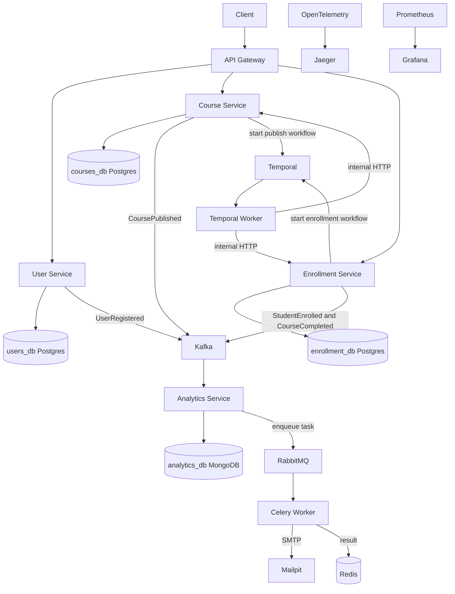
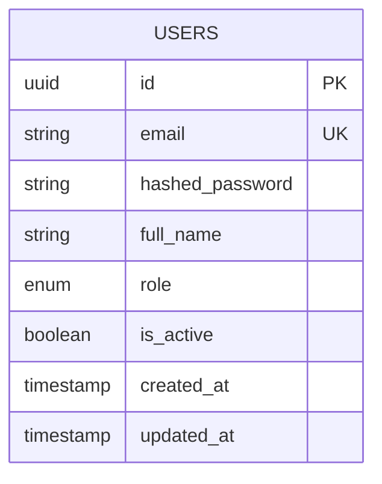
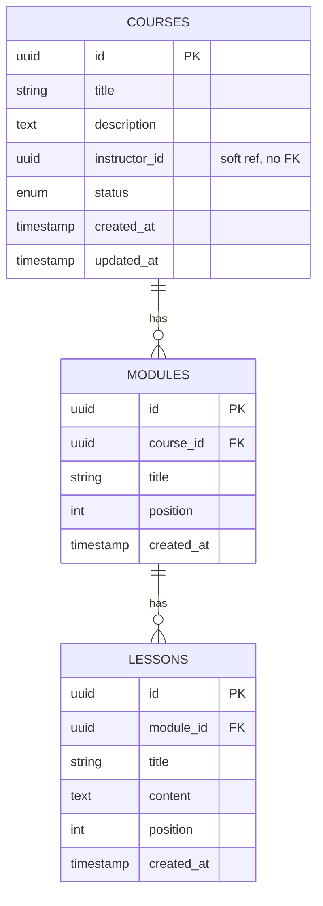
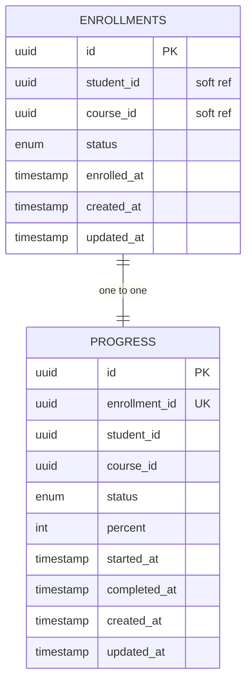
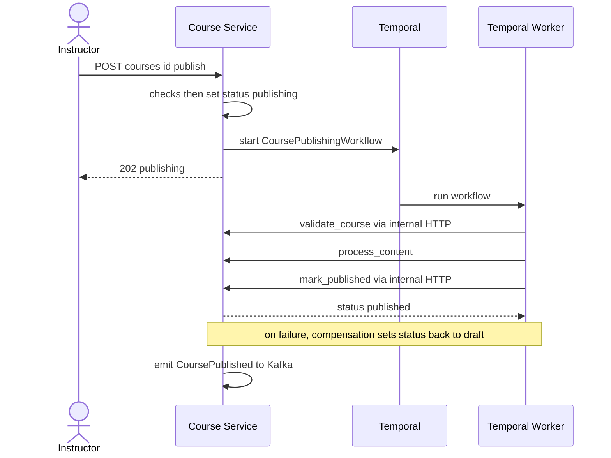
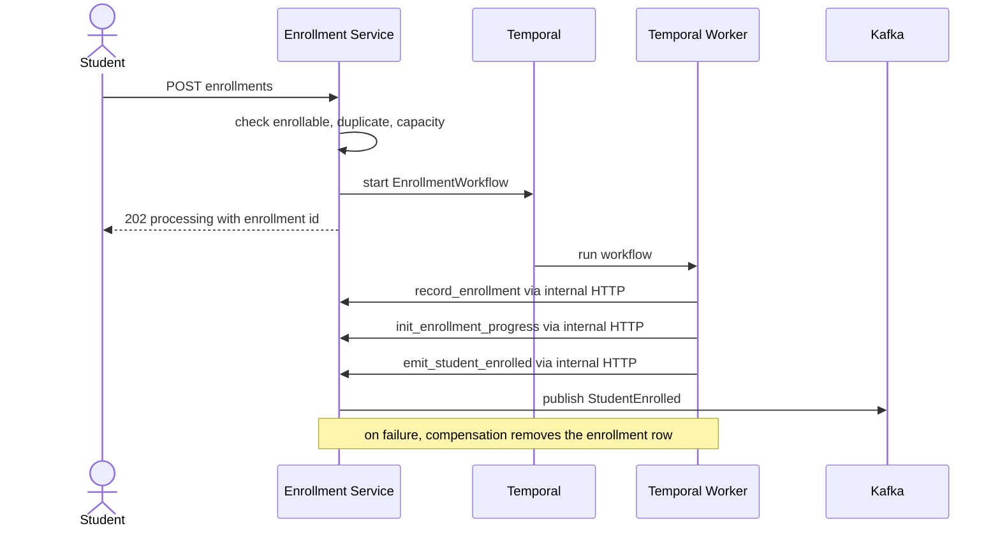
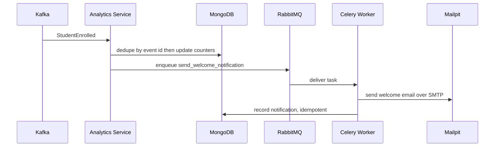
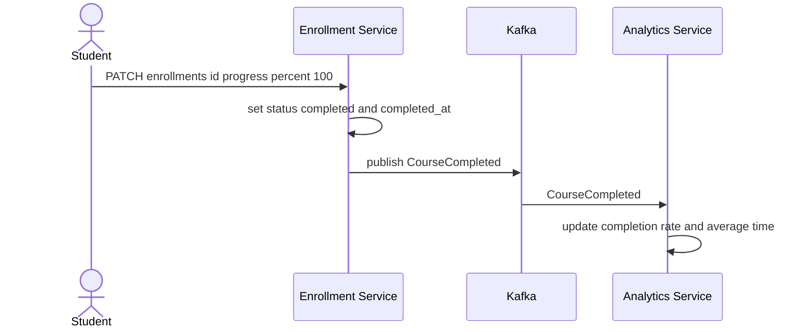

# SmartCourse — Part A System Design (Final)

This document describes the **as-built** backend for Part A of SmartCourse: the
architecture, services, data model, and the workflow and event flows that tie it
together. Everything here is implemented and running. Part A is the non-GenAI
foundation (course management, publishing, enrollment, analytics, background
processing, observability). The GenAI layer is Part B and is intentionally out of
scope for this document.

Architecture style is **microservices**, implemented in Python (FastAPI), packaged
with Docker Compose.

---

## 1. Design principles

Four principles run through the whole system:

- **Each service owns its data.** A service is the only process that connects to
  its own database. No other service — and not even the Temporal worker — reaches
  into another service's database.
- **Loose coupling.** Services talk over HTTP and authorize with a shared-secret
  JWT; background components talk over Kafka events. Nothing shares a database.
- **Async by default for side-effects.** Analytics, notifications, and other
  reactions run off the request path so they never block the user's request.
- **Reliability is designed in.** Durable orchestration (Temporal), idempotency,
  backpressure, and observability are first-class.

---

## 2. Final architecture

The synchronous request path is short: client to gateway to a core service to its
database. Publishing and enrollment are orchestrated durably by Temporal, whose
worker never touches a database — it calls the owning service's internal HTTP
endpoints. Analytics and notifications happen off the request path, driven by Kafka
events and executed by a Celery worker.

---

## 3. Component catalog

| Component | Responsibility | Type | Owns data | Host port |
| --- | --- | --- | --- | --- |
| API Gateway | Single entry point; routes and forwards `/api/*` | Service | none | 8000 |
| User Service | Identity: registration, login, roles; emits UserRegistered | Service | users_db | 8001 |
| Course Service | Course CRUD and lifecycle; modules and lessons; starts publish workflow; internal endpoints; emits CoursePublished | Service | courses_db | 8002 |
| Enrollment Service | Enrollments, progress; starts enrollment workflow; internal endpoints; emits StudentEnrolled and CourseCompleted | Service | enrollment_db | 8003 |
| Analytics Service | Consumes all events; maintains metrics; serves GET /analytics; enqueues notification tasks | Service and consumer | analytics_db | 8004 |
| Temporal Worker | Runs the publishing and enrollment workflows and activities; holds no database connection | Worker | none | none |
| Celery Worker | Runs background tasks; sends welcome email over SMTP | Worker | none | none |
| Temporal | Durable workflow orchestration engine | Infra | temporal-db | 7233 and UI 8088 |
| Kafka | Event backbone for fan-out | Infra | none | 9092 |
| RabbitMQ | Broker for Celery tasks | Infra | none | 5672 and UI 15672 |
| Redis | Celery result backend | Infra | none | 6379 |
| MongoDB | NoSQL analytics store | Infra | analytics_db | 27017 |
| Mailpit | Dev SMTP server and inbox for notifications | Infra | none | SMTP 1025 and UI 8025 |
| Jaeger | Distributed tracing UI | Infra | none | 16686 |
| Prometheus | Metrics scraping and storage | Infra | none | 9090 |
| Grafana | Metrics dashboards | Infra | none | 3000 |
| OpenTelemetry | Tracing instrumentation in the 3 main services | Library | none | none |

Kafka topics: `user.events`, `course.events`, `enrollment.events`, `progress.events`.

---

## 4. Data model

Each service owns its schema. There are **no cross-database foreign keys**;
cross-service references (`instructor_id`, `student_id`, `course_id`) are stored as
plain UUIDs — soft references upheld by tokens and events. Tables are created via
SQLAlchemy `create_all` at startup (no Alembic).

### 4.1 users_db — User Service

`role` is `student` or `instructor`. On successful registration the service emits a
`UserRegistered` event carrying the role, which analytics counts.

### 4.2 courses_db — Course Service

`course_status` is `draft`, `publishing`, `published`, or `archived`. The
`publishing` state exists so the publish workflow owns the transition: the endpoint
flips the course to `publishing`, and the workflow moves it to `published` on
success or back to `draft` on failure.

### 4.3 enrollment_db — Enrollment Service

`enrollments` has a unique constraint on `(student_id, course_id)` to block
duplicates. `enrollment.status` is `active`, `completed`, or `cancelled`.
`progress.status` is `not_started`, `in_progress`, or `completed`; `completed_at`
powers the average-time-to-complete metric. One progress row per enrollment.

### 4.4 analytics_db — Analytics Service (MongoDB)

Document collections rather than tables:

- `counters` — running totals keyed by name (total_students, total_instructors,
  total_courses_published, total_enrollments, total_completions,
  sum_completion_seconds, count_timed_completions, failed_events).
- `processed_events` — idempotency ledger keyed by `event_id` (dedupe).
- `course_enrollments` — per-course enrollment counts (most popular courses).
- `students` — distinct student ids (average courses per student).
- `enrollments_by_day` — per-day buckets (new enrollments over time).
- `notifications` — sent notifications, keyed by `event_id` (idempotent).

---

## 5. Workflows and event flows

### 5.1 Course publishing — Temporal workflow

Publishing is a multi-step process that must not corrupt state, so it is
orchestrated by Temporal. The worker holds no database connection; its activities
call course-service's internal HTTP endpoints.

### 5.2 Enrollment — Temporal workflow

Enrollment is now a Temporal workflow that mirrors publishing. The endpoint does
fast pre-checks, then starts the workflow, which durably records the enrollment,
initializes progress, and emits the event. The worker never touches the database;
it calls enrollment-service's internal HTTP endpoints. Kafka and Celery handle the
downstream fan-out unchanged.

### 5.3 Event fan-out — analytics and notifications

Every domain event flows to analytics; enrollment additionally triggers a
notification. This is choreography: independent consumers react without blocking.

Analytics also consumes `UserRegistered` (student and instructor counts),
`CoursePublished` (courses published), and `CourseCompleted` (completion rate and
time to complete).

### 5.4 Progress and completion

Progress updates are a normal endpoint, not a workflow — each update is a single
user action. On reaching 100 percent the service emits `CourseCompleted`, which
analytics consumes for completion metrics.

---

## 6. Analytics metrics

Served by `GET /analytics`, computed from the event stream:

- Total students and total instructors (from UserRegistered)
- Total courses published (from CoursePublished)
- Total enrollments and most popular courses (from StudentEnrolled)
- New enrollments over time, per day (from StudentEnrolled)
- Total completions, course completion rate, average time to complete (from CourseCompleted)
- Distinct students and average courses per student
- Failed events and notifications sent

All updates are idempotent: each event carries an `event_id` recorded in a
`processed_events` ledger, so redelivery never double-counts.

---

## 7. Observability

- **Tracing.** OpenTelemetry instruments the API gateway, course service, and
  enrollment service. Trace context propagates over HTTP, so a request through the
  gateway appears as one connected trace across services in Jaeger.
- **Metrics.** Each of the three main services exposes `/metrics`; Prometheus
  scrapes them; Grafana visualizes rates and latencies.
- **Logging.** All three main services emit structured JSON logs. The Temporal
  workflows and activities log each step and the compensation path.

---

## 8. Cross-cutting concerns

- **Idempotency.** Unique `(student_id, course_id)` blocks duplicate enrollments;
  Temporal workflow ids make starts idempotent; activities are safe to retry;
  every event has an `event_id` that consumers dedupe on.
- **Reliability and recovery.** Temporal makes publishing and enrollment durable
  and recoverable, with retries per step and compensation on failure, so partial
  state is never left behind.
- **High volume and backpressure.** Kafka buffers events in its log; Celery uses
  acks_late and a prefetch of one so workers drain at their own pace instead of
  being overwhelmed.
- **Separation of concerns.** Temporal orchestrates multi-step core processes;
  Kafka and Celery handle high-throughput fan-out; each service owns its data.

---

## 9. Key design decisions

| Decision | Why |
| --- | --- |
| Microservices over a monolith | Part A is inherently about independent, event-driven components |
| One database per service | Independent scaling, deployment, and failure isolation |
| No cross-service foreign keys | A foreign key cannot span two databases; use soft refs plus tokens and events |
| Temporal worker holds no database connection | Keeps each service the sole owner of its data; the worker calls internal HTTP endpoints |
| Temporal for publishing and enrollment | Multi-step, must-not-corrupt processes need durable, recoverable orchestration |
| Kafka and Celery kept for fan-out | Analytics and notifications are independent, high-volume reactions; keep them decoupled |
| Temporal orchestrates core, events handle fan-out | Satisfies recovery and idempotency via Temporal and high volume and backpressure via Kafka and Celery |
| MongoDB for analytics | Read-optimized document store fits aggregate metrics; satisfies the NoSQL requirement |
| create_all rather than Alembic | Schema is stable for this project; avoids migration overhead |
| UUID primary keys | Independent id generation across services |
