# SmartCourse — System Design

This document describes the full backend design for SmartCourse across both parts.
**Part A** is the non-GenAI foundation (course management, publishing, enrollment,
analytics, background processing, observability). **Part B** is the GenAI intelligent
learning assistant (contextual Q&A, content generation, semantic search). Both are
covered here as one system design so the complete target architecture and tech stack
are visible in a single view.

Architecture style is **microservices**, implemented in Python (FastAPI), packaged
with Docker Compose. The GenAI layer adds LangGraph/LangChain, an LLM provider, and a
vector database on top of the same service and event foundation.

---

## 1. Design principles

- **Each service owns its data.** A service is the only process that connects to its
  own database. No other service — and not even the Temporal worker — reaches into
  another service's database.
- **Loose coupling.** Services talk over HTTP and authorize with a shared-secret JWT;
  background components talk over Kafka events. Nothing shares a database.
- **Async by default for side-effects.** Analytics, notifications, and other
  reactions run off the request path so they never block the user's request.
- **Reliability is designed in.** Durable orchestration (Temporal), idempotency,
  backpressure, and observability are first-class.

---

## 2. Architecture

Two views. **2.1** is the system as built (Part A) — this is the one to read for
anything about the current implementation. **2.2** repeats the same foundation and
overlays the planned GenAI layer (Part B, dashed), which is designed but not
implemented.

Arrows are labeled with what triggers them. Line styles are consistent across both
diagrams:

- **Bold arrows (`==>`) are asynchronous messaging** — publishing an event to Kafka,
  Kafka delivering to a consumer, or enqueuing a task to RabbitMQ.
- **Thin solid arrows (`-->`) are synchronous calls and ownership** — HTTP requests
  between components, and a service owning its database.
- **Dotted arrays (`-.->`) are observability** in 2.1, and additionally the planned
  Part B components in 2.2.

Note on events and notifications: the two events produced inside Temporal workflows
— `CoursePublished` and `StudentEnrolled` — are published to Kafka by the Temporal
worker itself, as an orchestrated workflow step. The other two events are produced
directly by their services because they are not part of a workflow: `UserRegistered`
on registration, and `CourseCompleted` when a student's progress reaches 100 percent.
The welcome notification is also triggered directly by the enrollment workflow: the
worker enqueues the notification task to RabbitMQ. Analytics is metrics-only and is
no longer involved in notifications.

### 2.1 Part A — the system as built

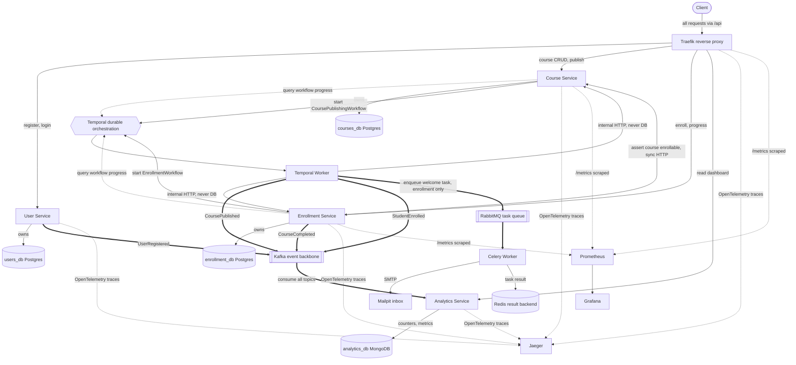

How to read the diagram, decision by decision:

- **One entry point.** All client traffic goes through Traefik, a purpose-built
  reverse proxy. Routing is declared as Docker labels on each service (a router
  matches a path prefix, a `stripprefix` middleware removes `/api`, and a service
  points at the container port), so the routing rules live next to the service they
  route to rather than in a separate config file. Traefik replaced a hand-written
  FastAPI proxy: it removes ~100 lines of Python from the hot path of every request
  and provides TLS termination, rate limiting, retries and load balancing as
  configuration. It was chosen over nginx because it has native OpenTelemetry and
  Prometheus support, so the edge remains the root span of every trace and still
  exposes metrics — both of which nginx would have cost or required extra components
  to replace.
- **One database per service, no cross-service foreign keys.** Each core service owns
  its own Postgres database; cross-service references are soft UUIDs.
- **Enrollment-service depends synchronously on course-service.** Before enrolling, it
  calls course-service over HTTP to confirm the course exists and is published — the
  one direct service-to-service dependency in the diagram. This is a real coupling
  point: if course-service is down, students cannot enroll, even though
  enrollment-service itself is healthy.
- **Temporal orchestrates multi-step, must-not-corrupt jobs** (publishing and
  enrollment), with retries and compensation.
- **The worker never touches a database.** For data writes it calls the owning
  service's internal HTTP endpoints, so each service stays the sole owner of its data.
- **Events produced inside a workflow are published by the Temporal worker directly**
  to Kafka (`CoursePublished`, `StudentEnrolled`) as an orchestrated step. This makes
  the workflow the clear owner of announcing that the workflow finished. Tradeoff:
  the worker now depends on Kafka being reachable and does slightly more than pure
  orchestration. Events produced outside any workflow (`UserRegistered`,
  `CourseCompleted`) are still published by their service.
- **Publishing to Kafka is not database access**, so the no-database rule for the
  worker is unaffected — Kafka is shared infrastructure, not a service's private store.
- **Analytics consumes every event and is idempotent by event id**; metrics land in
  MongoDB. Analytics is metrics-only and is not involved in notifications.
- **The enrollment workflow triggers the notification directly.** The worker enqueues
  the welcome-notification task to RabbitMQ (a workflow step), decoupling notifications
  from analytics. A Celery worker performs the send (results in Redis, email caught by
  Mailpit). Same tradeoff as the Kafka step: the worker also depends on RabbitMQ being
  reachable. Enqueuing to RabbitMQ is not database access, so the no-database rule for
  the worker still holds.
- **Tracing covers all five FastAPI services** (gateway, user, course, enrollment,
  analytics) via OpenTelemetry into Jaeger. Two known boundaries: the Temporal worker
  is not OTel-instrumented, so workflow steps appear in the Temporal UI rather than in
  Jaeger traces; and analytics' Kafka consumer runs on a background thread that
  `FastAPIInstrumentor` does not cover, so consumed events are not traced.
- **Prometheus scrapes `/metrics`** from the gateway, course-service, and
  enrollment-service; Grafana visualises those metrics.

### 2.2 Part A plus the planned GenAI layer (Part B)

The same foundation as 2.1, with the planned AI components overlaid as dashed nodes
and arrows. Part B is designed but **not implemented** — no Part B code exists in the
repository. It is shown here to demonstrate that the event-driven, service-per-domain
foundation extends to it without redesign.

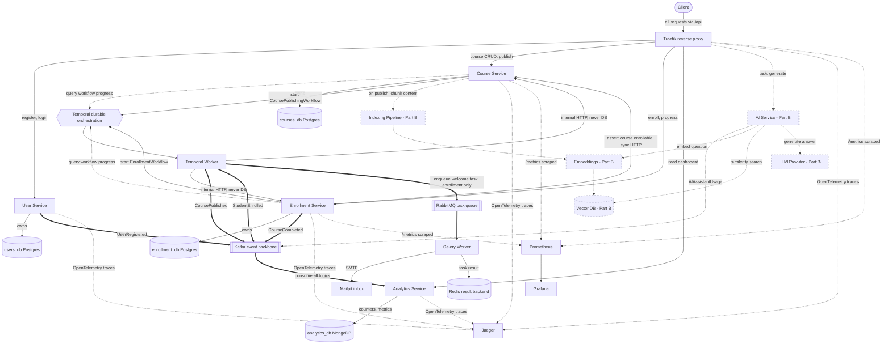

How Part B extends the same foundation:

- **The AI Service is just another service behind the same gateway**, with its own
  domain and its own store (the vector database) — the same pattern as the four
  existing services.
- **It reacts to an existing event.** Indexing is triggered on course publish, so the
  AI layer plugs into the `CoursePublished` event that already exists rather than
  requiring changes to course-service.
- **It emits its own event** (`AIAssistantUsage`) to the same Kafka backbone, so
  analytics could consume it for AI metrics without any change to the emitter.

## 3. Component catalog (BUILT)

| Component | Responsibility | Type | Owns data | Host port |
| --- | --- | --- | --- | --- |
| Traefik | Single entry point; routes `/api/*` by Docker labels; strips the `/api` prefix; emits OTel traces and Prometheus metrics | Reverse proxy (traefik:v3.1) | none | 8000 (public), 8080 (dashboard + /metrics) |
| User Service | Identity: registration, login, roles; emits UserRegistered | Service | users_db | 8001 |
| Course Service | Course CRUD and lifecycle; modules and lessons; starts publish workflow; internal endpoints; emits CoursePublished | Service | courses_db | 8002 |
| Enrollment Service | Enrollments and progress; starts enrollment workflow; internal endpoints; emits StudentEnrolled and CourseCompleted | Service and consumer of its own progress | enrollment_db | 8003 |
| Analytics Service | Consumes all events; maintains metrics; serves GET /analytics; enqueues notification tasks | Service and consumer | analytics_db | 8004 |
| Temporal Worker | Runs the publishing and enrollment workflows and activities; holds no database connection | Worker | none | none |
| Celery Worker | Runs background tasks; sends welcome email over SMTP | Worker | none | none |
| Temporal | Durable workflow orchestration engine | Infra | temporal-db | 7233 and UI 8088 |
| Kafka | Event backbone for fan-out | Infra | none | 9092 |
| RabbitMQ | Broker for Celery tasks | Infra | none | 5672 and UI 15672 |
| Redis | Celery result backend | Infra | none | 6379 |
| MongoDB | NoSQL analytics store | Infra | analytics_db | 27017 |
| Mailpit | Dev SMTP server and inbox for notifications | Infra | none | SMTP 1025 and UI 8025 |
| Jaeger | Distributed tracing UI | Infra | none | 16686 |
| Prometheus | Metrics scraping and storage | Infra | none | 9090 |
| Grafana | Metrics dashboards | Infra | none | 3000 |
| OpenTelemetry | Tracing instrumentation in the gateway, course, and enrollment services | Library | none | none |

Kafka topics: `user.events`, `course.events`, `enrollment.events`, `progress.events`.

---

## 4. Deployment / container view (BUILT)

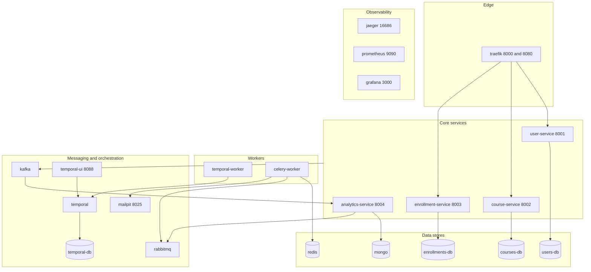

---

## 5. Data model (BUILT)

Each service owns its schema. Within a database, real foreign keys are used
(courses to modules to lessons). Across databases there are **no foreign keys**;
cross-service references (`instructor_id`, `student_id`, `course_id`) are plain UUIDs
— soft references upheld by tokens and events. Tables are created via SQLAlchemy
`create_all` at startup (no Alembic).

### 5.0 Whole-schema ERD (all services)

One view of every entity across the three Postgres databases. This is not a single
schema — the entities are grouped into three independent databases, and that grouping
is what determines the line style:

- **Solid** lines are **real foreign keys**, and they only ever exist *within* one
  service's database: `courses → modules → lessons` and `enrollments → progress`, all
  with `ON DELETE CASCADE`.
- **Dotted** lines are **soft references** that cross a database boundary: a plain UUID
  column with no foreign key, validated by the application (JWT identity, or an HTTP
  check to the owning service) rather than by the database. You cannot `JOIN` across
  these.

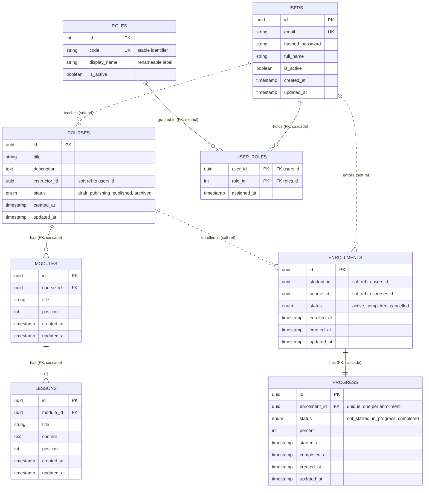

Enum states (native Postgres enums, so an invalid value is rejected by the database):

| Enum | Column | Possible states | Default |
| --- | --- | --- | --- |
| `course_status` | `courses.status` | `draft`, `publishing`, `published`, `archived` | `draft` |
| `enrollment_status` | `enrollments.status` | `active`, `completed`, `cancelled` | `active` |
| `progress_status` | `progress.status` | `not_started`, `in_progress`, `completed` | `not_started` |

Roles are deliberately **not** an enum. They live in the `roles` table as data, so a
new role is an inserted row and a renamed role is an updated row — neither requires a
schema migration or a code deploy. The other four state columns remain native Postgres
enums because their values are part of the application's logic, not user-managed data.

`course_status` is a small state machine: `draft → publishing → published`, with
`publishing → draft` as the failure/compensation path, and `→ archived` / `→ draft`
transitions available afterward. `publishing` is transient — it only exists while the
Temporal workflow is running.

### 5.1 users_db — User Service

Roles are **not** a column on `users`. A user holds zero or more roles through the
`user_roles` association table. This shape satisfies two requirements that a single
enum column could not:

1. **A user may hold several roles at once** (the same person can be both a student
   and an instructor) — that is simply more than one row in `user_roles`.
2. **A role's name may change** without a data migration. `roles.code` is the stable
   machine identifier (`student`) used by authorization checks, JWT claims and
   analytics, and never changes. `roles.display_name` is the human label (`Student`,
   later `Learner`) and may be changed freely: renaming it is a **single-row update**,
   regardless of how many users hold the role.

`users`

| Column | Type | Constraints | Notes |
| --- | --- | --- | --- |
| id | UUID | PK, default uuid4 | Generated by the service |
| email | VARCHAR(320) | Unique, indexed, not null | Login identifier |
| hashed_password | VARCHAR(255) | Not null | bcrypt hash; never returned |
| full_name | VARCHAR(255) | Not null | |
| is_active | BOOLEAN | Not null, default true | Soft-disable an account |
| created_at | TIMESTAMPTZ | Not null, default now | |
| updated_at | TIMESTAMPTZ | Not null, auto-updates | |

`roles` — a small seeded reference table. Adding or renaming a role is a row change,
never a migration or a code deploy.

| Column | Type | Constraints | Notes |
| --- | --- | --- | --- |
| id | SERIAL | PK | Small integer: roles are centrally seeded, not distributed, so the UUID rationale used elsewhere does not apply |
| code | VARCHAR(50) | Unique, indexed, not null | **Stable identifier** used by auth, JWTs and analytics. Never changes |
| display_name | VARCHAR(100) | Not null | Human label shown in the UI. **Free to change** |
| description | VARCHAR(255) | Nullable | |
| is_active | BOOLEAN | Not null, default true | |
| created_at / updated_at | TIMESTAMPTZ | Not null | |

`user_roles` — the many-to-many association table.

| Column | Type | Constraints | Notes |
| --- | --- | --- | --- |
| user_id | UUID | PK (composite), FK users.id ON DELETE CASCADE | Deleting a user removes their role links |
| role_id | INTEGER | PK (composite), FK roles.id ON DELETE RESTRICT | A role still held by users cannot be deleted |
| assigned_at | TIMESTAMPTZ | Not null, default now | |

Indexes and constraints: PK on `users.id`; unique index on `users.email`; unique index
on `roles.code`; composite PK `(user_id, role_id)` makes it impossible for a user to
hold the same role twice. Seeding is idempotent and **non-destructive** — it inserts
missing roles and never overwrites an existing row, so a renamed `display_name`
survives restarts. On successful registration the service emits `UserRegistered`
carrying the user's role **codes**, which analytics counts per role.

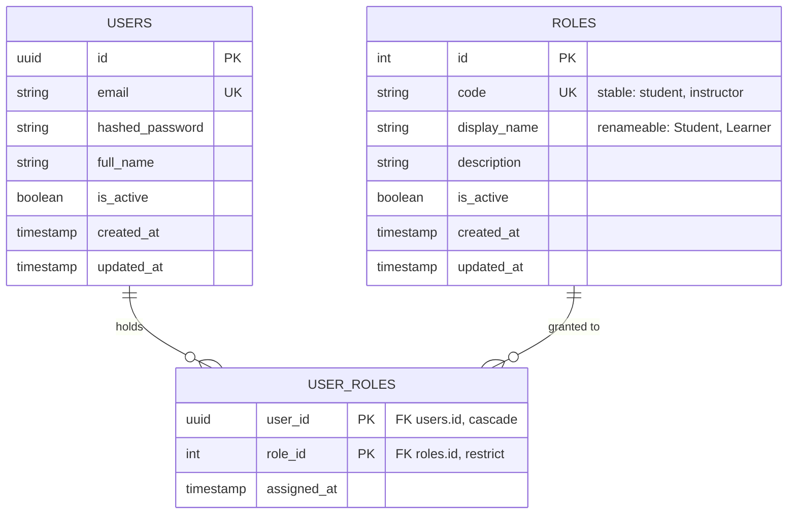

### 5.2 courses_db — Course Service

`courses`

| Column | Type | Constraints | Notes |
| --- | --- | --- | --- |
| id | UUID | PK, default uuid4 | |
| title | VARCHAR(255) | Not null | |
| description | TEXT | Not null, default '' | |
| instructor_id | UUID | Indexed, not null | Soft ref to users.id, no FK |
| status | ENUM course_status | Not null, default draft | draft, publishing, published, archived |
| created_at | TIMESTAMPTZ | Not null, default now | |
| updated_at | TIMESTAMPTZ | Not null, auto-updates | |

`modules`

| Column | Type | Constraints | Notes |
| --- | --- | --- | --- |
| id | UUID | PK, default uuid4 | |
| course_id | UUID | FK courses.id ON DELETE CASCADE, indexed, not null | Real FK, same DB |
| title | VARCHAR(255) | Not null | |
| position | INTEGER | Not null, default 0 | Ordering (order is a reserved word) |
| created_at | TIMESTAMPTZ | Not null, default now | |
| updated_at | TIMESTAMPTZ | Not null, auto-updates | |

`lessons`

| Column | Type | Constraints | Notes |
| --- | --- | --- | --- |
| id | UUID | PK, default uuid4 | |
| module_id | UUID | FK modules.id ON DELETE CASCADE, indexed, not null | Real FK, same DB |
| title | VARCHAR(255) | Not null | |
| content | TEXT | Not null, default '' | Lesson body text |
| position | INTEGER | Not null, default 0 | Ordering |
| created_at | TIMESTAMPTZ | Not null, default now | |
| updated_at | TIMESTAMPTZ | Not null, auto-updates | |

The `publishing` status is transient: the publish endpoint flips the course to
`publishing`, and the Temporal workflow moves it to `published` on success or back to
`draft` on failure. Cascade deletes remove a course's modules and their lessons.

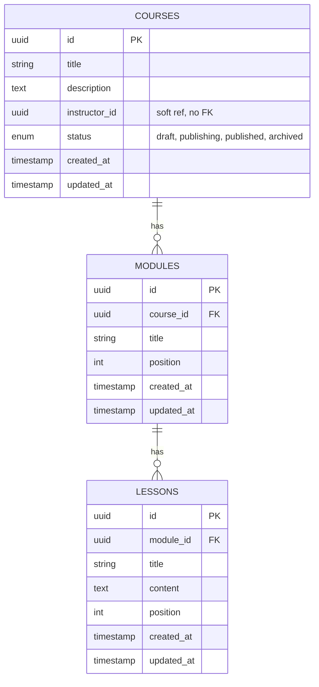

### 5.3 enrollment_db — Enrollment Service

`enrollments`

| Column | Type | Constraints | Notes |
| --- | --- | --- | --- |
| id | UUID | PK, default uuid4 | |
| student_id | UUID | Indexed, not null | Soft ref to users.id |
| course_id | UUID | Indexed, not null | Soft ref to courses.id |
| status | ENUM enrollment_status | Not null, default active | active, completed, cancelled |
| enrolled_at | TIMESTAMPTZ | Not null, default now | |
| created_at | TIMESTAMPTZ | Not null, default now | |
| updated_at | TIMESTAMPTZ | Not null, auto-updates | |

Unique constraint `uq_enrollment_student_course` on `(student_id, course_id)` blocks
duplicate enrollments.

`progress.enrollment_id` is a **real foreign key** to `enrollments.id` with
`ON DELETE CASCADE` — both tables live in the same database, so a database-level FK is
used. Deleting an enrollment now automatically removes its progress row (no orphans),
and the `uq_progress_enrollment` unique constraint still enforces exactly one progress
row per enrollment. Order matters at insert time: the enrollment row must exist before
its progress row, which the enrollment workflow guarantees (`record_enrollment` runs
before `init_enrollment_progress`).

`progress` does **not** store `student_id` or `course_id`: they already live on the
enrollment row and are reached via the FK, so duplicating them would be redundant
denormalization. Where they are needed — for example the `CourseCompleted` event — they
are read from the enrollment, the single source of truth.

`progress`

| Column | Type | Constraints | Notes |
| --- | --- | --- | --- |
| id | UUID | PK, default uuid4 | |
| enrollment_id | UUID | FK enrollments.id ON DELETE CASCADE, Unique uq_progress_enrollment, indexed, not null | Real FK (same DB); one progress row per enrollment |
| status | ENUM progress_status | Not null, default not_started | not_started, in_progress, completed |
| percent | INTEGER | Not null, default 0 | 0 to 100 |
| started_at | TIMESTAMPTZ | Nullable | Set when progress first moves off not_started |
| completed_at | TIMESTAMPTZ | Nullable | Set at 100 percent; powers time-to-complete |
| created_at | TIMESTAMPTZ | Not null, default now | |
| updated_at | TIMESTAMPTZ | Not null, auto-updates | |

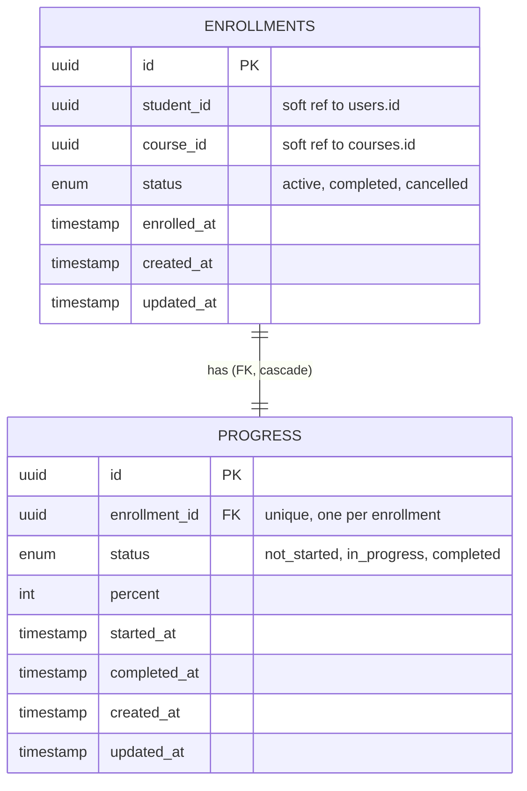

### 5.4 analytics_db — Analytics Service (MongoDB)

Document collections rather than tables:

| Collection | Key | Purpose |
| --- | --- | --- |
| counters | counter name | Running totals: total_students, total_instructors, total_courses_published, total_enrollments, total_completions, sum_completion_seconds, count_timed_completions, failed_events |
| processed_events | event_id | Idempotency ledger; dedupes redelivered events |
| course_enrollments | course_id | Per-course enrollment counts (most popular courses) |
| students | student_id | Distinct students (average courses per student) |
| enrollments_by_day | date | Per-day enrollment buckets (new enrollments over time) |
| notifications | event_id | Sent notifications, idempotent |

**Analytics data flow.** Analytics has two sides that meet only in MongoDB: a write
side that consumes every event and increments counters, and a read side that computes
the dashboard on demand. The write side is idempotent — it claims each `event_id` in
`processed_events` before acting, so a redelivered Kafka event is counted once.

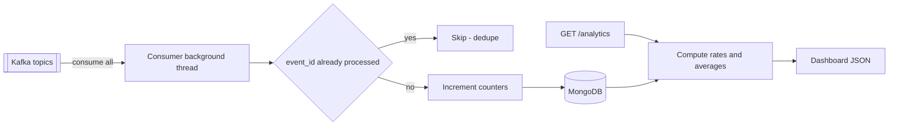

**Collection schemas.** MongoDB collections are independent documents keyed by `_id`;
there are no relationships, joins, or foreign keys between them — so this is a set of
standalone document shapes, not a relational ERD. Rates and averages (completion rate,
average time to complete) are not stored; they are derived at read time from the raw
counters below.

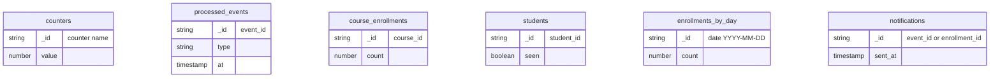

**Notification flow.** Notifications are fully separate from analytics. The enrollment
workflow enqueues the welcome-notification task to RabbitMQ directly; a Celery worker
runs it, claiming the id in the `notifications` collection first so a retried task never
sends a second email.

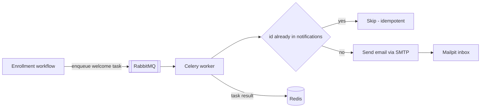

---

## 6. Internal API (worker-to-service, BUILT)

These endpoints exist so the Temporal worker can drive database work without holding
a database connection. They are guarded by a shared secret header `X-Internal-Key`
and are not exposed through the public gateway.

Course Service (`/courses/{id}/internal`):

- `GET /publish-check` — returns status and whether the course has content
- `POST /status` — apply a validated status transition
- `GET /content` — return lesson text (read-only; consumed by the chunking scaffold)

Enrollment Service (`/internal/enrollments`):

- `POST /record` — create the enrollment row with a workflow-supplied id (idempotent)
- `POST /progress` — initialize progress (idempotent)
- `POST /emit-enrolled` — publish StudentEnrolled to Kafka
- `POST /rollback` — compensation: remove the enrollment row

All return typed Pydantic responses.

---

## 7. Workflows and event flows (BUILT)

### 7.1 Course publishing — Temporal workflow

The endpoint validates only; it does **not** change the course's status. The
draft-to-publishing flip is the workflow's first activity (`begin_publishing`), so the
workflow owns the entire status transition. If the workflow never starts (for example
Temporal is unreachable), the course simply stays DRAFT — it cannot be stranded in
PUBLISHING.

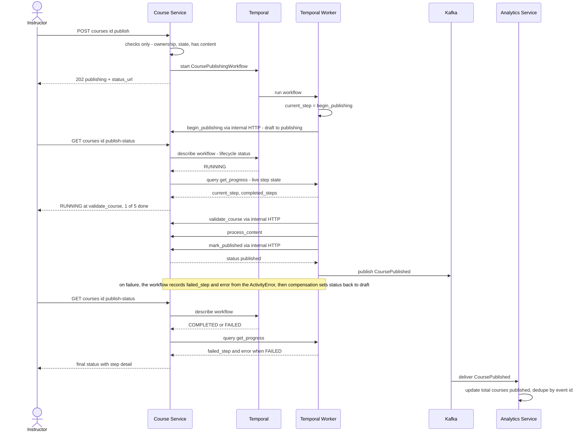

### 7.2 Enrollment — Temporal workflow

The endpoint does fast pre-checks, then starts the workflow. The worker records the
enrollment and initializes progress via enrollment-service's internal endpoints (it
never touches the database), then publishes the StudentEnrolled event to Kafka and
enqueues the welcome-notification task to RabbitMQ directly. Analytics consumes the
Kafka event for metrics only; the notification no longer goes through analytics.

Status reporting differs from publishing in one important way. Compensation **deletes**
the enrollment row, so after a failure there is no row left to authorize against. The
workflow therefore records its own `student_id` before the first activity and returns it
from the progress query, and the status endpoint authorizes the caller against the
workflow rather than the row. That is why this endpoint touches no database at all — a
student can still see why their enrollment failed after the row is gone.

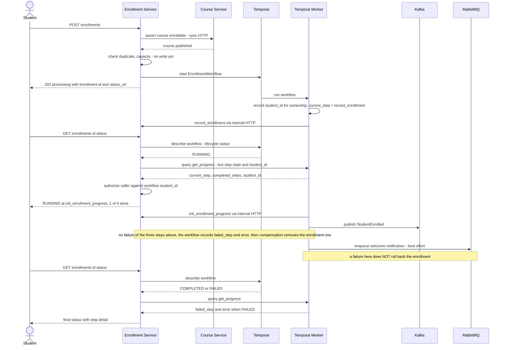

### 7.3 Downstream reactions — analytics metrics and notification

These two paths are independent, both set off by the enrollment workflow. Analytics
reacts to the Kafka event for metrics only; the Celery worker performs the emailing
after the workflow enqueues the task.

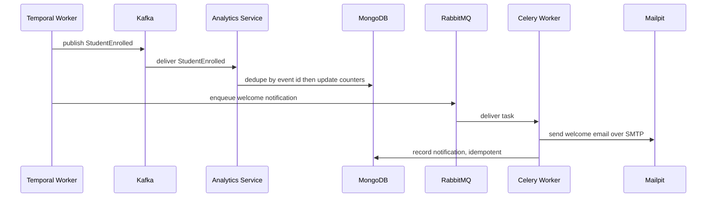

Analytics also consumes `UserRegistered`, `CoursePublished`, and `CourseCompleted`
for metrics. It is no longer involved in notifications.

### 7.4 Progress and completion

Progress updates are a normal endpoint, not a workflow — each update is a single user
action. On reaching 100 percent the service emits `CourseCompleted`.

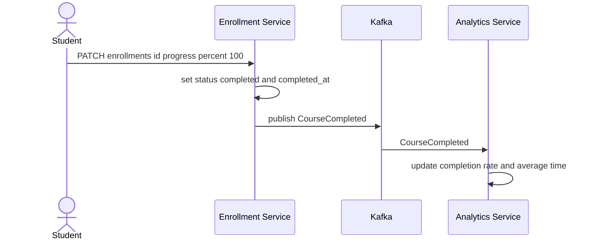

---

### 7.5 Async status reporting (202 plus polling)

Both workflows return `202 Accepted` immediately, so the caller needs a way to learn
what happened afterwards. Making the endpoints synchronous was rejected: the publish
flow has a five-minute content-processing timeout, which exceeds typical proxy and
browser timeouts, and holding the connection open for the workflow's duration would
give up the durability Temporal provides — if the client disconnects, the outcome is
unknown again.

Instead each service exposes a status endpoint the client polls:

| Flow | Start | Poll |
| --- | --- | --- |
| Publishing | `POST /api/courses/{id}/publish` → 202 + `status_url` | `GET /api/courses/{id}/publish-status` |
| Enrollment | `POST /api/enrollments` → 202 + `enrollment_id` + `status_url` | `GET /api/enrollments/{id}/status` |

Each poll makes **two** calls to Temporal, answering two different questions:

- **`describe()`** asks the Temporal *server* for the workflow's lifecycle status
  (`RUNNING`, `COMPLETED`, `FAILED`, `TERMINATED`). This is authoritative, and it is the
  only source for termination: a workflow cannot record its own ending, because it stops
  executing the moment it returns or raises. It is also what the client uses to decide
  when to stop polling.
- **`query("get_progress")`** asks the *workflow itself* for its internal step state.
  Temporal queries are read-only, side-effect free, and can run against a RUNNING
  workflow. The workflow tracks `current_step` and `completed_steps` in memory, so no
  database writes are needed for progress reporting.

On failure the workflow extracts the failing step from the `ActivityError` it catches —
`activity_type` gives the activity's registered name and `cause` gives the original
error (for example `validate_course` / `Course has no lessons`) — and stores them for
the query to report. If the query is unavailable, the endpoint falls back to
`describe()` alone, and if a failed workflow yields no detail it re-raises
`handle.result()` to recover the reason. The response is therefore always correct,
degrading from rich to basic rather than to nothing.

A typical response while running:

```json
{
  "status": "RUNNING",
  "current_step": "process_content",
  "completed_steps": ["begin_publishing", "validate_course"],
  "total_steps": 5,
  "failed_step": null,
  "error": null
}
```

and on failure:

```json
{
  "status": "FAILED",
  "current_step": "failed",
  "completed_steps": ["begin_publishing"],
  "failed_step": "validate_course",
  "error": "Course has no lessons"
}
```

`completed_steps` is what tells the user how far the workflow got before breaking.
Returning `total_steps` and `steps` lets a client render a progress bar without
hardcoding any knowledge of the workflow.

**Known boundary.** Queries only work while the workflow record still exists in
Temporal; once it ages out of retention the status endpoint returns 404. Making failure
history durable beyond retention would require persisting the reason (a `publish_error`
column on the course, or an `enrollment_failures` table) — designed, not built.

---

## 8. Analytics metrics (BUILT)

Served by `GET /analytics`, computed from the event stream:

- Total students and total instructors (from UserRegistered)
- Total courses published (from CoursePublished)
- Total enrollments and most popular courses (from StudentEnrolled)
- New enrollments over time, per day (from StudentEnrolled)
- Total completions, course completion rate, average time to complete (from CourseCompleted)
- Distinct students and average courses per student
- Failed events and notifications sent

All updates are idempotent via the `processed_events` ledger keyed by `event_id`.

---

## 9. Observability (BUILT)

- **Tracing.** Traefik emits OpenTelemetry spans natively at the edge, and
  OpenTelemetry instruments all four FastAPI services — user, course, enrollment and
  analytics. Trace context propagates over HTTP, so a request entering through Traefik
  appears as one connected trace across services in Jaeger, rooted at the proxy. Keeping
  that root span was a deciding factor in choosing Traefik over nginx. Two known
  boundaries: the Temporal worker is not OTel-instrumented, so workflow steps are
  observed in the Temporal UI rather than in Jaeger; and analytics' Kafka consumer runs
  on a background thread that `FastAPIInstrumentor` does not cover, so consumed events
  are not traced.
- **Metrics.** Traefik exposes Prometheus metrics natively on its dashboard entrypoint,
  and the course and enrollment services expose `/metrics`; Prometheus scrapes all
  three; Grafana visualizes rates and latencies.
- **Logging.** The core services emit structured JSON logs to stdout. The Temporal
  workflows and activities log each step and the compensation path.

---

## 10. Cross-cutting concerns (BUILT)

- **Idempotency.** Unique `(student_id, course_id)` blocks duplicate enrollments;
  Temporal workflow ids make starts idempotent; activities are safe to retry; every
  event has an `event_id` that consumers dedupe on.
- **Reliability and recovery.** Temporal makes publishing and enrollment durable and
  recoverable, with retries per step and compensation on failure, so partial state is
  never left behind.
- **High volume and backpressure.** Kafka buffers events in its log; Celery uses
  acks_late and a prefetch of one so workers drain at their own pace.
- **Separation of concerns.** Temporal orchestrates multi-step core processes; Kafka
  and Celery handle high-throughput fan-out; each service owns its data.
- **Authentication and authorization.** User-service is the sole issuer of JWTs; every
  other service verifies the signature locally with the shared secret, so there is no
  per-request call to an auth service. The token carries `roles` as a list of stable
  role codes, and each service's `require_*` dependency checks membership. Ownership is
  enforced separately in the service layer (`get_owned_course`, `get_owned_enrollment`),
  so a role grants the kind of action and ownership grants the specific resource. For
  backward compatibility during the multi-role rollout, the services also accept the
  legacy single `role` claim so tokens issued before the change keep working until they
  expire.

---

## 11. Key design decisions (BUILT)

| Decision | Why |
| --- | --- |
| Microservices over a monolith | Part A is inherently about independent, event-driven components |
| One database per service | Independent scaling, deployment, and failure isolation |
| No cross-service foreign keys | A foreign key cannot span two databases; use soft refs plus tokens and events |
| Temporal worker holds no database connection | Keeps each service the sole owner of its data; the worker calls internal HTTP endpoints |
| Temporal for publishing and enrollment | Multi-step, must-not-corrupt processes need durable, recoverable orchestration |
| Kafka and Celery kept for fan-out | Analytics and notifications are independent, high-volume reactions; keep them decoupled |
| Temporal orchestrates core, events handle fan-out | Satisfies recovery and idempotency via Temporal and high volume and backpressure via Kafka and Celery |
| MongoDB for analytics | Read-optimized document store fits aggregate metrics; satisfies the NoSQL requirement |
| create_all rather than Alembic | Schema is stable for this project; avoids migration overhead |
| UUID primary keys | Independent id generation across services |
| Traefik at the edge rather than a hand-written FastAPI proxy | A purpose-built proxy removes ~100 lines of Python from every request path and provides TLS, rate limiting, retries and load balancing as configuration. Chosen over nginx for native OpenTelemetry and Prometheus support, which keeps the edge as the trace root |
| 202 plus a polling status endpoint rather than synchronous workflows | A synchronous endpoint would exceed proxy and browser timeouts and would give up Temporal's durability if the client disconnects |
| Temporal queries for live step progress | Read-only and callable against a running workflow, so progress reporting needs no database writes |
| Roles in a `roles` table with a `user_roles` join table | Supports a user holding several roles, and separates the stable `code` (used by auth and JWTs) from the renameable `display_name`, so renaming a role is a one-row update rather than a migration across every user |
| JWT carries `roles` as a list of codes | Authorization checks membership rather than equality; display names are never used for authorization, which is what makes renaming safe |

---

## 12. Resolved decisions (previously open in the Week 1 design)

| Question raised early | How it was resolved |
| --- | --- |
| Are analytics and notifications separate services? | Analytics is a separate service; notification is a Celery task inside the analytics service, not its own service |
| Where does content processing live? | Handled inside the publishing Temporal workflow (process_content activity), not a separate worker |
| Which NoSQL store, and where? | MongoDB, used for the analytics store |
| Orchestration vs choreography boundary | Publishing and enrollment use Temporal orchestration; analytics and notifications use Kafka and Celery fan-out |
| Admin role | Implemented as student and instructor only |
| Migrations | create_all retained; Alembic not adopted |

---

## 13. Part B — Intelligent Learning Assistant (GenAI layer)

Part B adds a GenAI layer on top of Part A: contextual question answering over
course material, automated content generation for instructors, and semantic search.
It builds directly on the existing services and event backbone — publishing already
produces the content that Part B indexes, and the same Kafka and Temporal patterns
carry into the AI pipeline.

### 13.1 Part B components and tech stack

| Component | Responsibility | Tech |
| --- | --- | --- |
| AI Service | Hosts the assistant API: Q&A and content generation; orchestrates retrieval and LLM calls; streams responses | Python, FastAPI, LangGraph or LangChain |
| Embedding component | Turns text chunks and questions into vectors | Sentence-transformers or a hosted embedding model |
| Vector DB | Stores chunk embeddings; serves similarity search for retrieval | Vector database (for example Qdrant, Chroma, or pgvector) |
| Indexing pipeline | On publish, chunk lesson content, embed it, and upsert into the vector DB | Extends the publishing Temporal workflow |
| LLM provider | Generates answers, summaries, objectives, and quizzes | OpenAI, Groq, or Anthropic |
| Retrieval-Augmented Generation (RAG) | Retrieve relevant chunks then condition the LLM on them for grounded answers | LangChain or LangGraph orchestration |
| Streaming delivery | Incremental token-by-token delivery of long responses | Server-sent events or chunked HTTP |

The rest of the stack is shared with Part A: FastAPI services, Kafka for events,
Temporal for orchestration, Celery and RabbitMQ for background work, MongoDB and
Postgres for data, and the Prometheus, Grafana, Jaeger, and OpenTelemetry
observability stack.

### 13.2 Content indexing pipeline (data preparation)

When a course is published, its content is chunked, embedded, and stored for
semantic search. This extends the existing publishing workflow's content-processing
step.

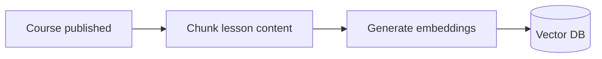

### 13.3 Contextual Q&A (retrieval-augmented generation)

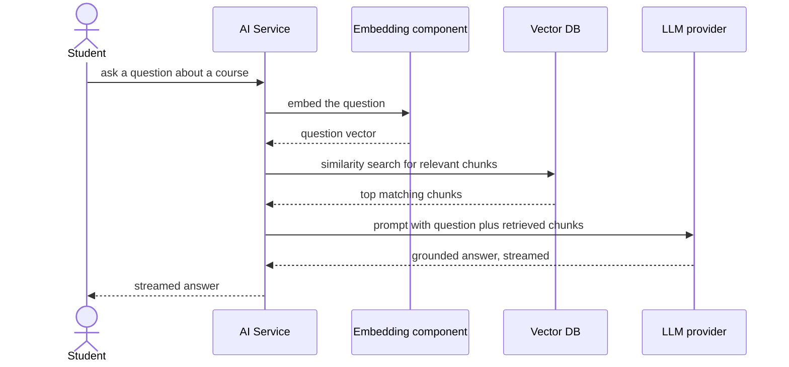

### 13.4 Content generation for instructors

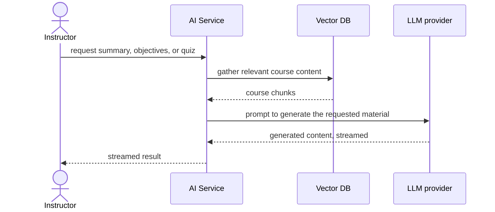

### 13.5 Part B data model

- **Vector DB** — one record per chunk: an embedding vector plus metadata
  (course_id, lesson_id, chunk index, and the chunk text) for filtering and
  citation.
- **Chunk source** — chunks are derived from `lessons.content` in courses_db; the
  vector DB holds the derived, embedded form for retrieval.
- **AI Assistant Usage** — recorded in the analytics store: questions asked and
  answered, and the type of assistance (contextual Q&A or generated content).

### 13.6 Part B analytics and observability

- **AI Assistant Usage metric** — added to `GET /analytics`: number of questions
  asked and answered, and assistance type. Emitted as events from the AI service and
  consumed by the analytics service, consistent with the Part A event pattern.
- **Observability** — the AI service is traced with OpenTelemetry into Jaeger and
  exposes Prometheus metrics, so assistant interactions and LLM call latency are
  diagnosable alongside the rest of the system.

### 13.7 Part B design decisions

| Decision | Why |
| --- | --- |
| Separate AI service | Keeps GenAI concerns and heavy LLM dependencies isolated from the core services |
| RAG over fine-tuning | Grounds answers in the actual course content and stays current as courses change |
| Vector DB for retrieval | Purpose-built for similarity search over embeddings |
| Indexing tied to publishing | Content is prepared exactly when it becomes available, reusing the publishing workflow |
| Streaming responses | Long answers and generated content are delivered incrementally so they do not block |
| Events for AI usage metrics | Reuses the Part A Kafka and analytics pattern for consistency |
