# SmartCourse — System Design

This document describes the full backend design for SmartCourse across both parts.
**Part A** is the non-GenAI foundation (course management, publishing, enrollment,
analytics, background processing, observability). **Part B** is the GenAI intelligent
learning assistant (contextual Q&A, content generation, semantic search). Both are
covered here as one system design so the complete target architecture and tech stack
are visible in a single view.

Architecture style is **microservices**, implemented in Python (FastAPI), packaged
with Docker Compose. The GenAI layer adds LangGraph/LangChain, an LLM provider, and a
vector database on top of the same service and event foundation.

---

## 1. Design principles

- **Each service owns its data.** A service is the only process that connects to its
  own database. No other service — and not even the Temporal worker — reaches into
  another service's database.
- **Loose coupling.** Services talk over HTTP and authorize with a shared-secret JWT;
  background components talk over Kafka events. Nothing shares a database.
- **Async by default for side-effects.** Analytics, notifications, and other
  reactions run off the request path so they never block the user's request.
- **Reliability is designed in.** Durable orchestration (Temporal), idempotency,
  backpressure, and observability are first-class.

---

## 2. Architecture (entire system)

One component-level view of the whole SmartCourse architecture. Arrows are labeled
with what triggers them. Part A is built; the AI layer (Part B) is shown dashed as
the planned GenAI extension on the same foundation.

Note on events and notifications: the two events produced inside Temporal workflows
— `CoursePublished` and `StudentEnrolled` — are published to Kafka by the Temporal
worker itself, as an orchestrated workflow step. The other two events are produced
directly by their services because they are not part of a workflow: `UserRegistered`
on registration, and `CourseCompleted` when a student's progress reaches 100 percent.
The welcome notification is also triggered directly by the enrollment workflow: the
worker enqueues the notification task to RabbitMQ. Analytics is metrics-only and is
no longer involved in notifications.

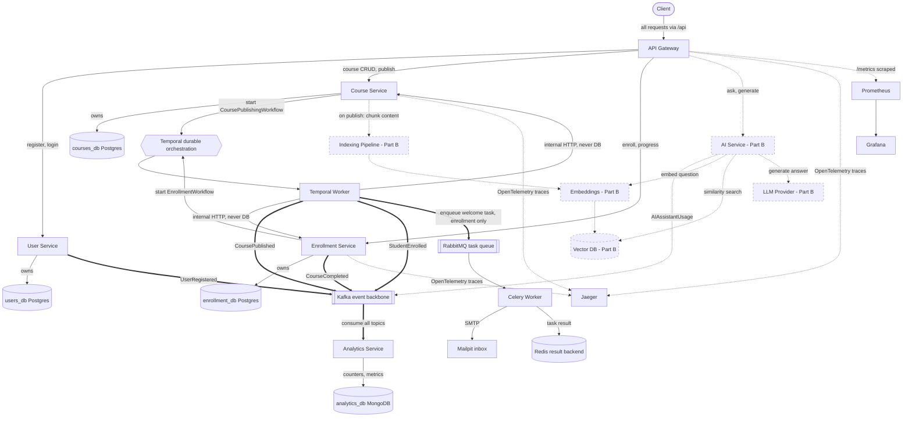

How to read the diagram, decision by decision:

- **One entry point.** All client traffic goes through the API Gateway.
- **One database per service, no cross-service foreign keys.** Each core service owns
  its own Postgres database; cross-service references are soft UUIDs.
- **Temporal orchestrates multi-step, must-not-corrupt jobs** (publishing and
  enrollment), with retries and compensation.
- **The worker never touches a database.** For data writes it calls the owning
  service's internal HTTP endpoints, so each service stays the sole owner of its data.
- **Events produced inside a workflow are published by the Temporal worker directly**
  to Kafka (`CoursePublished`, `StudentEnrolled`) as an orchestrated step. This makes
  the workflow the clear owner of announcing that the workflow finished. Tradeoff:
  the worker now depends on Kafka being reachable and does slightly more than pure
  orchestration. Events produced outside any workflow (`UserRegistered`,
  `CourseCompleted`) are still published by their service.
- **Publishing to Kafka is not database access**, so the no-database rule for the
  worker is unaffected — Kafka is shared infrastructure, not a service's private store.
- **Analytics consumes every event and is idempotent by event id**; metrics land in
  MongoDB. Analytics is metrics-only and is not involved in notifications.
- **The enrollment workflow triggers the notification directly.** The worker enqueues
  the welcome-notification task to RabbitMQ (a workflow step), decoupling notifications
  from analytics. A Celery worker performs the send (results in Redis, email caught by
  Mailpit). Same tradeoff as the Kafka step: the worker also depends on RabbitMQ being
  reachable. Enqueuing to RabbitMQ is not database access, so the no-database rule for
  the worker still holds.
- **Observability is built in** via OpenTelemetry, Jaeger, Prometheus, and Grafana.
- **The AI layer (dashed) is planned** on the same foundation.

---

## 3. Component catalog (BUILT)

| Component | Responsibility | Type | Owns data | Host port |
| --- | --- | --- | --- | --- |
| API Gateway | Single entry point; routes and forwards `/api/*`; strips the `/api` prefix | Service | none | 8000 |
| User Service | Identity: registration, login, roles; emits UserRegistered | Service | users_db | 8001 |
| Course Service | Course CRUD and lifecycle; modules and lessons; starts publish workflow; internal endpoints; emits CoursePublished | Service | courses_db | 8002 |
| Enrollment Service | Enrollments and progress; starts enrollment workflow; internal endpoints; emits StudentEnrolled and CourseCompleted | Service and consumer of its own progress | enrollment_db | 8003 |
| Analytics Service | Consumes all events; maintains metrics; serves GET /analytics; enqueues notification tasks | Service and consumer | analytics_db | 8004 |
| Temporal Worker | Runs the publishing and enrollment workflows and activities; holds no database connection | Worker | none | none |
| Celery Worker | Runs background tasks; sends welcome email over SMTP | Worker | none | none |
| Temporal | Durable workflow orchestration engine | Infra | temporal-db | 7233 and UI 8088 |
| Kafka | Event backbone for fan-out | Infra | none | 9092 |
| RabbitMQ | Broker for Celery tasks | Infra | none | 5672 and UI 15672 |
| Redis | Celery result backend | Infra | none | 6379 |
| MongoDB | NoSQL analytics store | Infra | analytics_db | 27017 |
| Mailpit | Dev SMTP server and inbox for notifications | Infra | none | SMTP 1025 and UI 8025 |
| Jaeger | Distributed tracing UI | Infra | none | 16686 |
| Prometheus | Metrics scraping and storage | Infra | none | 9090 |
| Grafana | Metrics dashboards | Infra | none | 3000 |
| OpenTelemetry | Tracing instrumentation in the gateway, course, and enrollment services | Library | none | none |

Kafka topics: `user.events`, `course.events`, `enrollment.events`, `progress.events`.

---

## 4. Deployment / container view (BUILT)

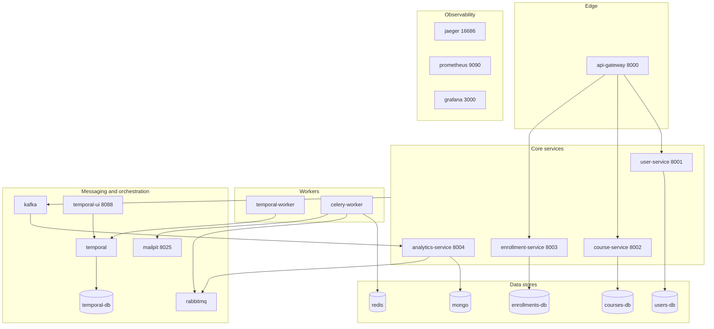

---

## 5. Data model (BUILT)

Each service owns its schema. Within a database, real foreign keys are used
(courses to modules to lessons). Across databases there are **no foreign keys**;
cross-service references (`instructor_id`, `student_id`, `course_id`) are plain UUIDs
— soft references upheld by tokens and events. Tables are created via SQLAlchemy
`create_all` at startup (no Alembic).

### 5.1 users_db — User Service

`users`

| Column | Type | Constraints | Notes |
| --- | --- | --- | --- |
| id | UUID | PK, default uuid4 | Generated by the service |
| email | VARCHAR(320) | Unique, indexed, not null | Login identifier |
| hashed_password | VARCHAR(255) | Not null | bcrypt hash; never returned |
| full_name | VARCHAR(255) | Not null | |
| role | ENUM user_role | Not null, default student | student or instructor |
| is_active | BOOLEAN | Not null, default true | Soft-disable an account |
| created_at | TIMESTAMPTZ | Not null, default now | |
| updated_at | TIMESTAMPTZ | Not null, auto-updates | |

Indexes and constraints: PK on `id`; unique index on `email`; native Postgres enum
`user_role`. On successful registration the service emits `UserRegistered` (with role)
which analytics counts.

### 5.2 courses_db — Course Service

`courses`

| Column | Type | Constraints | Notes |
| --- | --- | --- | --- |
| id | UUID | PK, default uuid4 | |
| title | VARCHAR(255) | Not null | |
| description | TEXT | Not null, default '' | |
| instructor_id | UUID | Indexed, not null | Soft ref to users.id, no FK |
| status | ENUM course_status | Not null, default draft | draft, publishing, published, archived |
| created_at | TIMESTAMPTZ | Not null, default now | |
| updated_at | TIMESTAMPTZ | Not null, auto-updates | |

`modules`

| Column | Type | Constraints | Notes |
| --- | --- | --- | --- |
| id | UUID | PK, default uuid4 | |
| course_id | UUID | FK courses.id ON DELETE CASCADE, indexed, not null | Real FK, same DB |
| title | VARCHAR(255) | Not null | |
| position | INTEGER | Not null, default 0 | Ordering (order is a reserved word) |
| created_at | TIMESTAMPTZ | Not null, default now | |
| updated_at | TIMESTAMPTZ | Not null, auto-updates | |

`lessons`

| Column | Type | Constraints | Notes |
| --- | --- | --- | --- |
| id | UUID | PK, default uuid4 | |
| module_id | UUID | FK modules.id ON DELETE CASCADE, indexed, not null | Real FK, same DB |
| title | VARCHAR(255) | Not null | |
| content | TEXT | Not null, default '' | Lesson body text |
| position | INTEGER | Not null, default 0 | Ordering |
| created_at | TIMESTAMPTZ | Not null, default now | |
| updated_at | TIMESTAMPTZ | Not null, auto-updates | |

The `publishing` status is transient: the publish endpoint flips the course to
`publishing`, and the Temporal workflow moves it to `published` on success or back to
`draft` on failure. Cascade deletes remove a course's modules and their lessons.

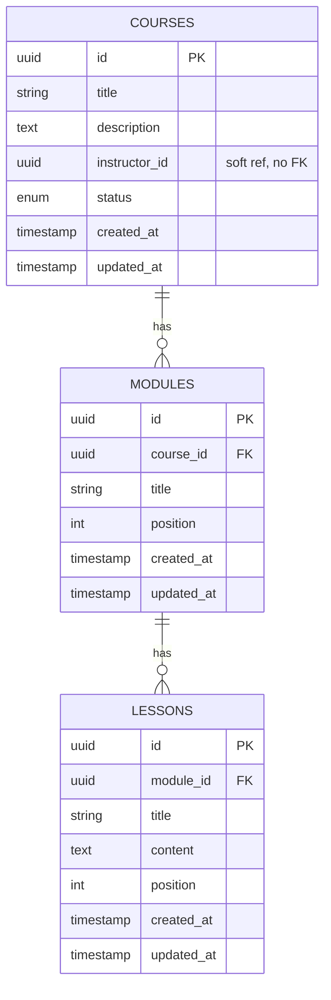

### 5.3 enrollment_db — Enrollment Service

`enrollments`

| Column | Type | Constraints | Notes |
| --- | --- | --- | --- |
| id | UUID | PK, default uuid4 | |
| student_id | UUID | Indexed, not null | Soft ref to users.id |
| course_id | UUID | Indexed, not null | Soft ref to courses.id |
| status | ENUM enrollment_status | Not null, default active | active, completed, cancelled |
| enrolled_at | TIMESTAMPTZ | Not null, default now | |
| created_at | TIMESTAMPTZ | Not null, default now | |
| updated_at | TIMESTAMPTZ | Not null, auto-updates | |

Unique constraint `uq_enrollment_student_course` on `(student_id, course_id)` blocks
duplicate enrollments.

`progress`

| Column | Type | Constraints | Notes |
| --- | --- | --- | --- |
| id | UUID | PK, default uuid4 | |
| enrollment_id | UUID | Unique uq_progress_enrollment, indexed, not null | One progress row per enrollment |
| student_id | UUID | Indexed, not null | Soft ref |
| course_id | UUID | Indexed, not null | Soft ref |
| status | ENUM progress_status | Not null, default not_started | not_started, in_progress, completed |
| percent | INTEGER | Not null, default 0 | 0 to 100 |
| started_at | TIMESTAMPTZ | Nullable | Set when progress first moves off not_started |
| completed_at | TIMESTAMPTZ | Nullable | Set at 100 percent; powers time-to-complete |
| created_at | TIMESTAMPTZ | Not null, default now | |
| updated_at | TIMESTAMPTZ | Not null, auto-updates | |

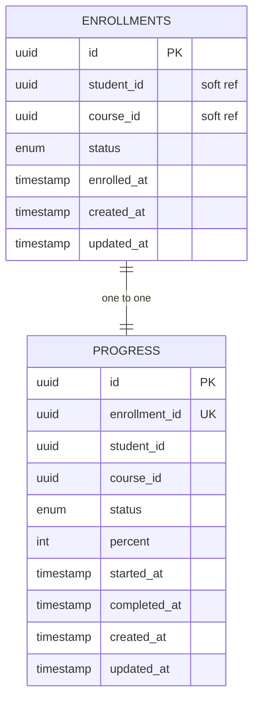

### 5.4 analytics_db — Analytics Service (MongoDB)

Document collections rather than tables:

| Collection | Key | Purpose |
| --- | --- | --- |
| counters | counter name | Running totals: total_students, total_instructors, total_courses_published, total_enrollments, total_completions, sum_completion_seconds, count_timed_completions, failed_events |
| processed_events | event_id | Idempotency ledger; dedupes redelivered events |
| course_enrollments | course_id | Per-course enrollment counts (most popular courses) |
| students | student_id | Distinct students (average courses per student) |
| enrollments_by_day | date | Per-day enrollment buckets (new enrollments over time) |
| notifications | event_id | Sent notifications, idempotent |

---

## 6. Internal API (worker-to-service, BUILT)

These endpoints exist so the Temporal worker can drive database work without holding
a database connection. They are guarded by a shared secret header `X-Internal-Key`
and are not exposed through the public gateway.

Course Service (`/courses/{id}/internal`):

- `GET /publish-check` — returns status and whether the course has content
- `POST /status` — apply a validated status transition
- `GET /content` — return lesson text (read-only; consumed by the chunking scaffold)

Enrollment Service (`/internal/enrollments`):

- `POST /record` — create the enrollment row with a workflow-supplied id (idempotent)
- `POST /progress` — initialize progress (idempotent)
- `POST /emit-enrolled` — publish StudentEnrolled to Kafka
- `POST /rollback` — compensation: remove the enrollment row

All return typed Pydantic responses.

---

## 7. Workflows and event flows (BUILT)

### 7.1 Course publishing — Temporal workflow

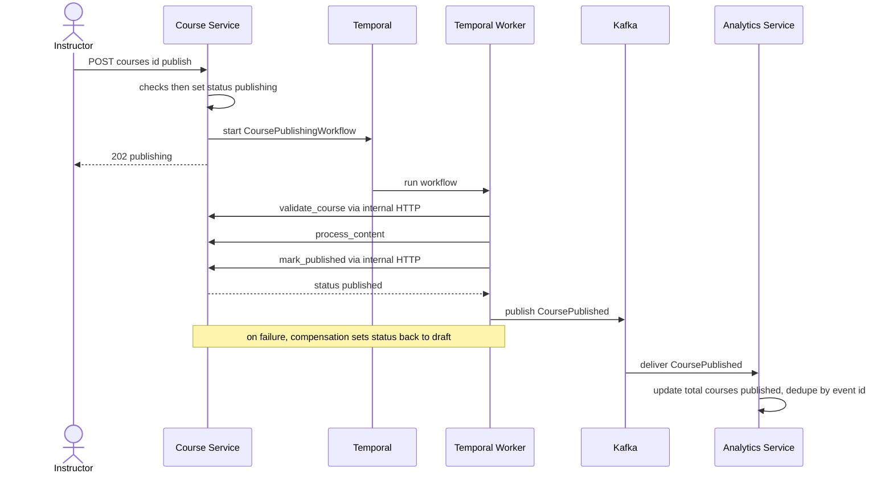

### 7.2 Enrollment — Temporal workflow

The endpoint does fast pre-checks, then starts the workflow. The worker records the
enrollment and initializes progress via enrollment-service's internal endpoints (it
never touches the database), then publishes the StudentEnrolled event to Kafka and
enqueues the welcome-notification task to RabbitMQ directly. Analytics consumes the
Kafka event for metrics only; the notification no longer goes through analytics.

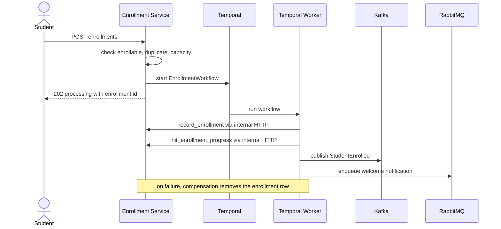

### 7.3 Downstream reactions — analytics metrics and notification

These two paths are independent, both set off by the enrollment workflow. Analytics
reacts to the Kafka event for metrics only; the Celery worker performs the emailing
after the workflow enqueues the task.

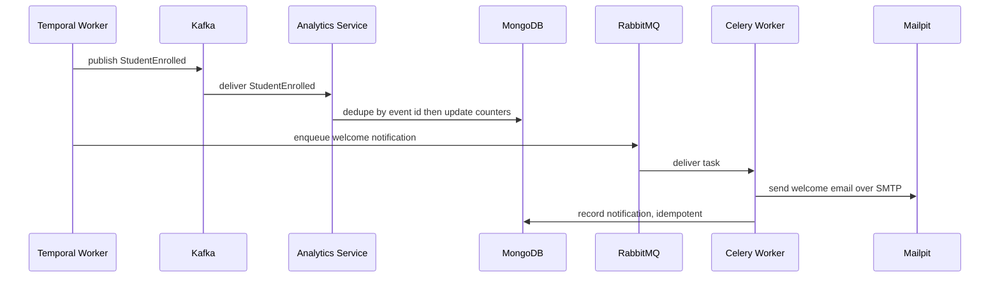

Analytics also consumes `UserRegistered`, `CoursePublished`, and `CourseCompleted`
for metrics. It is no longer involved in notifications.

### 7.4 Progress and completion

Progress updates are a normal endpoint, not a workflow — each update is a single user
action. On reaching 100 percent the service emits `CourseCompleted`.

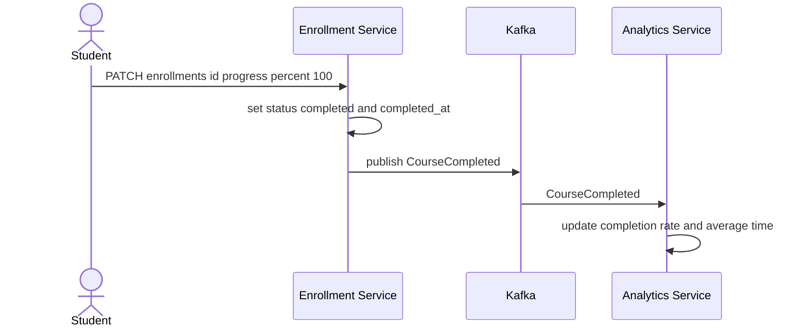

---

## 8. Analytics metrics (BUILT)

Served by `GET /analytics`, computed from the event stream:

- Total students and total instructors (from UserRegistered)
- Total courses published (from CoursePublished)
- Total enrollments and most popular courses (from StudentEnrolled)
- New enrollments over time, per day (from StudentEnrolled)
- Total completions, course completion rate, average time to complete (from CourseCompleted)
- Distinct students and average courses per student
- Failed events and notifications sent

All updates are idempotent via the `processed_events` ledger keyed by `event_id`.

---

## 9. Observability (BUILT)

- **Tracing.** OpenTelemetry instruments the API gateway, course service, and
  enrollment service. Trace context propagates over HTTP, so a request through the
  gateway appears as one connected trace across services in Jaeger.
- **Metrics.** Each of the three main services exposes `/metrics`; Prometheus scrapes
  them; Grafana visualizes rates and latencies.
- **Logging.** The three main services emit structured JSON logs. The Temporal
  workflows and activities log each step and the compensation path.

---

## 10. Cross-cutting concerns (BUILT)

- **Idempotency.** Unique `(student_id, course_id)` blocks duplicate enrollments;
  Temporal workflow ids make starts idempotent; activities are safe to retry; every
  event has an `event_id` that consumers dedupe on.
- **Reliability and recovery.** Temporal makes publishing and enrollment durable and
  recoverable, with retries per step and compensation on failure, so partial state is
  never left behind.
- **High volume and backpressure.** Kafka buffers events in its log; Celery uses
  acks_late and a prefetch of one so workers drain at their own pace.
- **Separation of concerns.** Temporal orchestrates multi-step core processes; Kafka
  and Celery handle high-throughput fan-out; each service owns its data.

---

## 11. Key design decisions (BUILT)

| Decision | Why |
| --- | --- |
| Microservices over a monolith | Part A is inherently about independent, event-driven components |
| One database per service | Independent scaling, deployment, and failure isolation |
| No cross-service foreign keys | A foreign key cannot span two databases; use soft refs plus tokens and events |
| Temporal worker holds no database connection | Keeps each service the sole owner of its data; the worker calls internal HTTP endpoints |
| Temporal for publishing and enrollment | Multi-step, must-not-corrupt processes need durable, recoverable orchestration |
| Kafka and Celery kept for fan-out | Analytics and notifications are independent, high-volume reactions; keep them decoupled |
| Temporal orchestrates core, events handle fan-out | Satisfies recovery and idempotency via Temporal and high volume and backpressure via Kafka and Celery |
| MongoDB for analytics | Read-optimized document store fits aggregate metrics; satisfies the NoSQL requirement |
| create_all rather than Alembic | Schema is stable for this project; avoids migration overhead |
| UUID primary keys | Independent id generation across services |

---

## 12. Resolved decisions (previously open in the Week 1 design)

| Question raised early | How it was resolved |
| --- | --- |
| Are analytics and notifications separate services? | Analytics is a separate service; notification is a Celery task inside the analytics service, not its own service |
| Where does content processing live? | Handled inside the publishing Temporal workflow (process_content activity), not a separate worker |
| Which NoSQL store, and where? | MongoDB, used for the analytics store |
| Orchestration vs choreography boundary | Publishing and enrollment use Temporal orchestration; analytics and notifications use Kafka and Celery fan-out |
| Admin role | Implemented as student and instructor only |
| Migrations | create_all retained; Alembic not adopted |

---

## 13. Part B — Intelligent Learning Assistant (GenAI layer)

Part B adds a GenAI layer on top of Part A: contextual question answering over
course material, automated content generation for instructors, and semantic search.
It builds directly on the existing services and event backbone — publishing already
produces the content that Part B indexes, and the same Kafka and Temporal patterns
carry into the AI pipeline.

### 13.1 Part B components and tech stack

| Component | Responsibility | Tech |
| --- | --- | --- |
| AI Service | Hosts the assistant API: Q&A and content generation; orchestrates retrieval and LLM calls; streams responses | Python, FastAPI, LangGraph or LangChain |
| Embedding component | Turns text chunks and questions into vectors | Sentence-transformers or a hosted embedding model |
| Vector DB | Stores chunk embeddings; serves similarity search for retrieval | Vector database (for example Qdrant, Chroma, or pgvector) |
| Indexing pipeline | On publish, chunk lesson content, embed it, and upsert into the vector DB | Extends the publishing Temporal workflow |
| LLM provider | Generates answers, summaries, objectives, and quizzes | OpenAI, Groq, or Anthropic |
| Retrieval-Augmented Generation (RAG) | Retrieve relevant chunks then condition the LLM on them for grounded answers | LangChain or LangGraph orchestration |
| Streaming delivery | Incremental token-by-token delivery of long responses | Server-sent events or chunked HTTP |

The rest of the stack is shared with Part A: FastAPI services, Kafka for events,
Temporal for orchestration, Celery and RabbitMQ for background work, MongoDB and
Postgres for data, and the Prometheus, Grafana, Jaeger, and OpenTelemetry
observability stack.

### 13.2 Content indexing pipeline (data preparation)

When a course is published, its content is chunked, embedded, and stored for
semantic search. This extends the existing publishing workflow's content-processing
step.

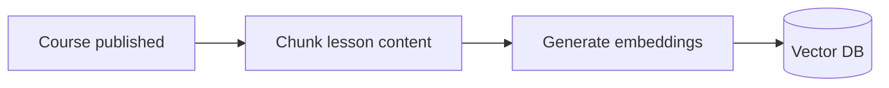

### 13.3 Contextual Q&A (retrieval-augmented generation)

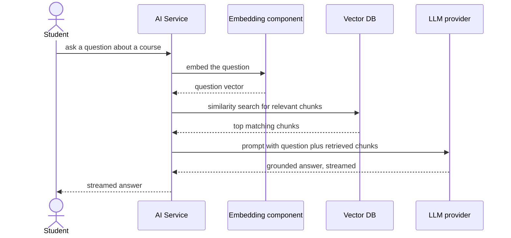

### 13.4 Content generation for instructors

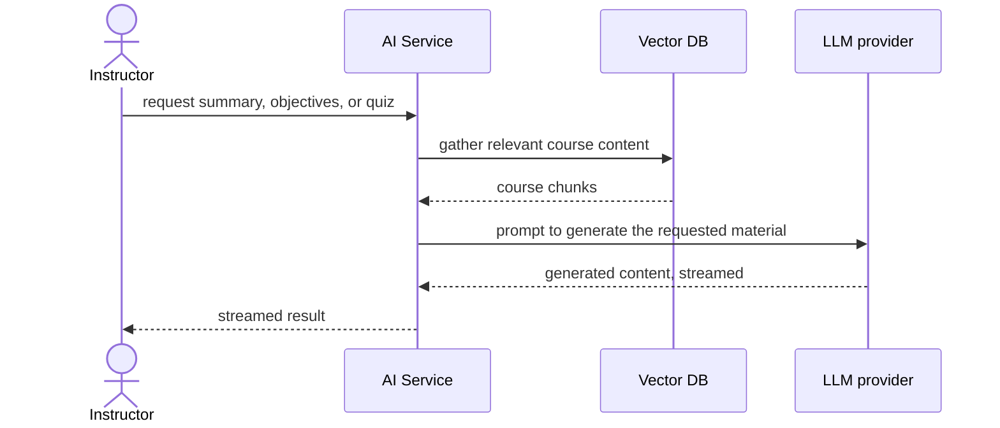

### 13.5 Part B data model

- **Vector DB** — one record per chunk: an embedding vector plus metadata
  (course_id, lesson_id, chunk index, and the chunk text) for filtering and
  citation.
- **Chunk source** — chunks are derived from `lessons.content` in courses_db; the
  vector DB holds the derived, embedded form for retrieval.
- **AI Assistant Usage** — recorded in the analytics store: questions asked and
  answered, and the type of assistance (contextual Q&A or generated content).

### 13.6 Part B analytics and observability

- **AI Assistant Usage metric** — added to `GET /analytics`: number of questions
  asked and answered, and assistance type. Emitted as events from the AI service and
  consumed by the analytics service, consistent with the Part A event pattern.
- **Observability** — the AI service is traced with OpenTelemetry into Jaeger and
  exposes Prometheus metrics, so assistant interactions and LLM call latency are
  diagnosable alongside the rest of the system.

### 13.7 Part B design decisions

| Decision | Why |
| --- | --- |
| Separate AI service | Keeps GenAI concerns and heavy LLM dependencies isolated from the core services |
| RAG over fine-tuning | Grounds answers in the actual course content and stays current as courses change |
| Vector DB for retrieval | Purpose-built for similarity search over embeddings |
| Indexing tied to publishing | Content is prepared exactly when it becomes available, reusing the publishing workflow |
| Streaming responses | Long answers and generated content are delivered incrementally so they do not block |
| Events for AI usage metrics | Reuses the Part A Kafka and analytics pattern for consistency |
