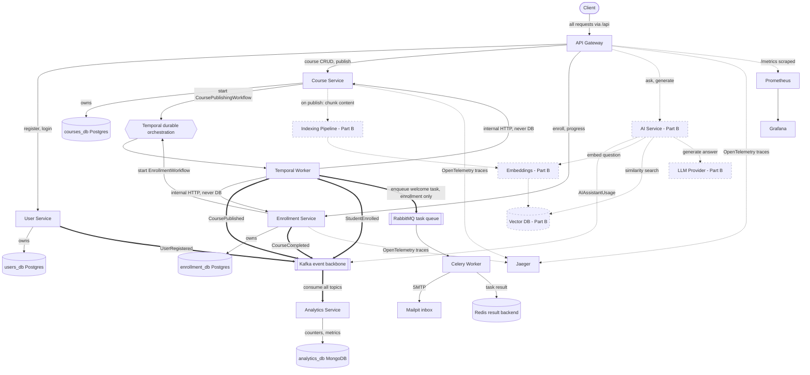
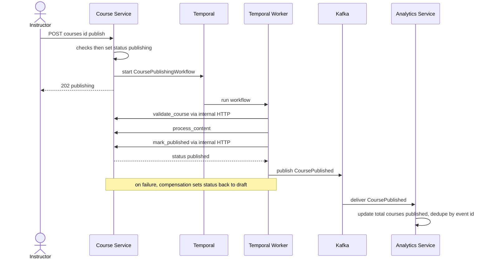
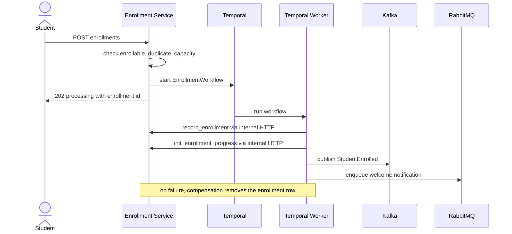
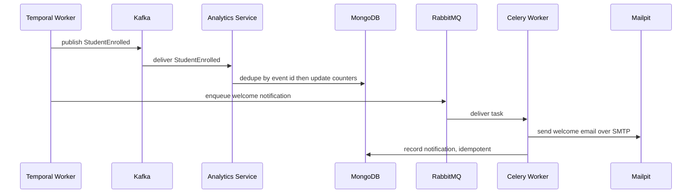
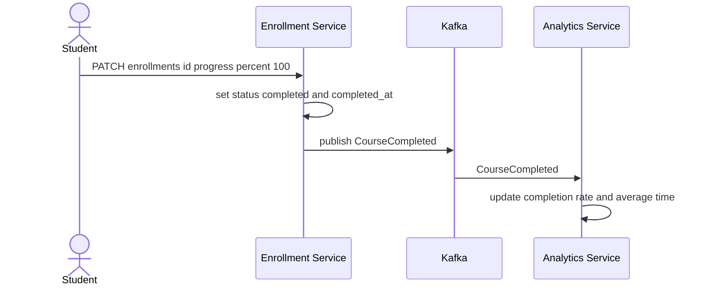

# SmartCourse — System Design

This document describes the full backend design for SmartCourse across both parts.
**Part A** is the non-GenAI foundation (course management, publishing, enrollment,
analytics, background processing, observability). **Part B** is the GenAI intelligent
learning assistant (contextual Q&A, content generation, semantic search). Both are
covered here as one system design so the complete target architecture and tech stack
are visible in a single view.

Architecture style is **microservices**, implemented in Python (FastAPI), packaged
with Docker Compose. The GenAI layer adds LangGraph/LangChain, an LLM provider, and a
vector database on top of the same service and event foundation.

---

## 1. Design principles

- **Each service owns its data.** A service is the only process that connects to its
  own database. No other service — and not even the Temporal worker — reaches into
  another service's database.
- **Loose coupling.** Services talk over HTTP and authorize with a shared-secret JWT;
  background components talk over Kafka events. Nothing shares a database.
- **Async by default for side-effects.** Analytics, notifications, and other
  reactions run off the request path so they never block the user's request.
- **Reliability is designed in.** Durable orchestration (Temporal), idempotency,
  backpressure, and observability are first-class.

---

## 2. Architecture (entire system)

One component-level view of the whole SmartCourse architecture. Arrows are labeled
with what triggers them. Part A is built; the AI layer (Part B) is shown dashed as
the planned GenAI extension on the same foundation.

Note on events and notifications: the two events produced inside Temporal workflows
— `CoursePublished` and `StudentEnrolled` — are published to Kafka by the Temporal
worker itself, as an orchestrated workflow step. The other two events are produced
directly by their services because they are not part of a workflow: `UserRegistered`
on registration, and `CourseCompleted` when a student's progress reaches 100 percent.
The welcome notification is also triggered directly by the enrollment workflow: the
worker enqueues the notification task to RabbitMQ. Analytics is metrics-only and is
no longer involved in notifications.

How to read the diagram, decision by decision:

- **One entry point.** All client traffic goes through the API Gateway.
- **One database per service, no cross-service foreign keys.** Each core service owns
  its own Postgres database; cross-service references are soft UUIDs.
- **Temporal orchestrates multi-step, must-not-corrupt jobs** (publishing and
  enrollment), with retries and compensation.
- **The worker never touches a database.** For data writes it calls the owning
  service's internal HTTP endpoints, so each service stays the sole owner of its data.
- **Events produced inside a workflow are published by the Temporal worker directly**
  to Kafka (`CoursePublished`, `StudentEnrolled`) as an orchestrated step. This makes
  the workflow the clear owner of announcing that the workflow finished. Tradeoff:
  the worker now depends on Kafka being reachable and does slightly more than pure
  orchestration. Events produced outside any workflow (`UserRegistered`,
  `CourseCompleted`) are still published by their service.
- **Publishing to Kafka is not database access**, so the no-database rule for the
  worker is unaffected — Kafka is shared infrastructure, not a service's private store.
- **Analytics consumes every event and is idempotent by event id**; metrics land in
  MongoDB. Analytics is metrics-only and is not involved in notifications.
- **The enrollment workflow triggers the notification directly.** The worker enqueues
  the welcome-notification task to RabbitMQ (a workflow step), decoupling notifications
  from analytics. A Celery worker performs the send (results in Redis, email caught by
  Mailpit). Same tradeoff as the Kafka step: the worker also depends on RabbitMQ being
  reachable. Enqueuing to RabbitMQ is not database access, so the no-database rule for
  the worker still holds.
- **Observability is built in** via OpenTelemetry, Jaeger, Prometheus, and Grafana.
- **The AI layer (dashed) is planned** on the same foundation.

---

### 7.1 Course publishing — Temporal workflow

### 7.2 Enrollment — Temporal workflow

The endpoint does fast pre-checks, then starts the workflow. The worker records the
enrollment and initializes progress via enrollment-service's internal endpoints (it
never touches the database), then publishes the StudentEnrolled event to Kafka and
enqueues the welcome-notification task to RabbitMQ directly. Analytics consumes the
Kafka event for metrics only; the notification no longer goes through analytics.

### 7.3 Downstream reactions — analytics metrics and notification

These two paths are independent, both set off by the enrollment workflow. Analytics
reacts to the Kafka event for metrics only; the Celery worker performs the emailing
after the workflow enqueues the task.

Analytics also consumes `UserRegistered`, `CoursePublished`, and `CourseCompleted`
for metrics. It is no longer involved in notifications.

### 7.4 Progress and completion

Progress updates are a normal endpoint, not a workflow — each update is a single user
action. On reaching 100 percent the service emits `CourseCompleted`.

---

