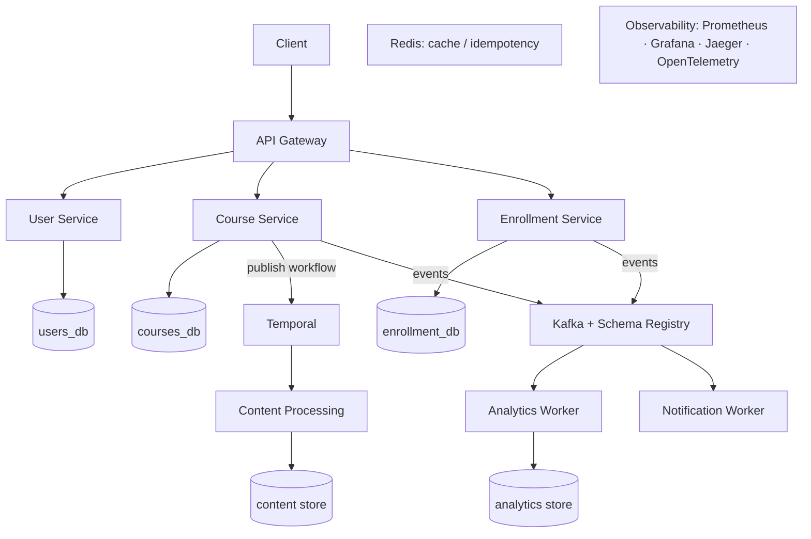
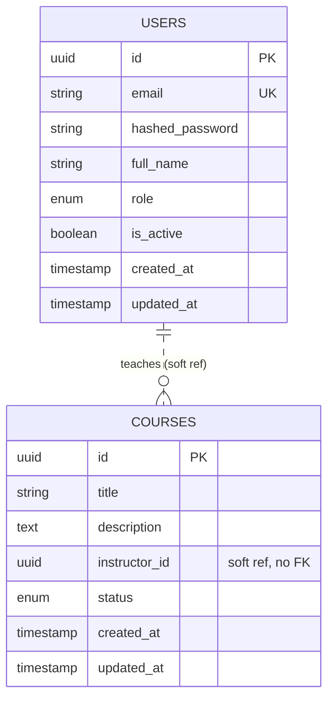
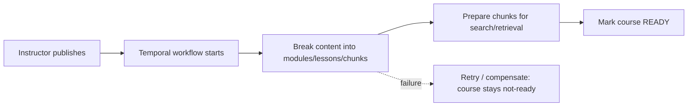
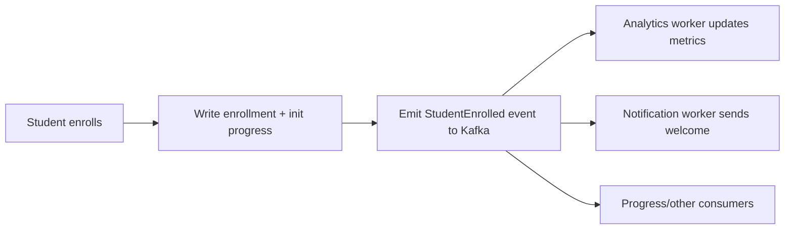

# SmartCourse — Part A System Design

This is the **initial system design for all of Part A** (Weeks 1–3): the target
backend architecture, service decomposition, end-state data model, and the
workflow/event flows that tie it together. Architecture style is **microservices**
throughout, implemented in Python (FastAPI).

**How to read status markers.** Part A is delivered iteratively and reviewed week
by week, so each element is tagged:

- **[BUILT · W1]** — designed and implemented now.
- **[PLANNED · W2] / [PLANNED · W3]** — target architecture, to be refined as it is
  implemented. Service decomposition for these phases is a *proposal* to validate
  with the mentor, not a finalized contract.

---

## 1. Design approach & principles

Part A is built as independent services rather than one application, because Part A
is fundamentally about independent, event-driven components (Temporal, Kafka,
Celery). Four principles run through the whole design:

- **Each service owns its data.** A service is the only process that connects to
  its own database; no other service reaches in.
- **Loose coupling.** Services talk over HTTP through a gateway and authorize via a
  shared-secret token — never by sharing a database.
- **Async by default for side-effects.** Anything that isn't needed to answer the
  user's request (analytics, notifications, indexing) runs in the background so it
  never blocks or slows the main flow.
- **Reliability is designed in.** Idempotency, recoverable workflows, and
  observability are first-class, not afterthoughts.

---

## 2. Target architecture (all of Part A)

The synchronous request path is short: client → gateway → a core service → its
database. Everything else (publishing steps, analytics, notifications, content
processing) happens off the request path, driven by Temporal workflows and Kafka
events and executed by Celery workers.

---

## 3. Service & component catalog

| Component                 | Responsibility                                            | Type    | Owns data        | Status         |
| ------------------------- | --------------------------------------------------------- | ------- | ---------------- | -------------- |
| API Gateway               | Single entry point; routes `/api/*`                       | Service | —                | BUILT · W1     |
| User Service              | Identity: registration, login, users, roles               | Service | `users_db`       | BUILT · W1     |
| Course Service            | Course CRUD + lifecycle status                            | Service | `courses_db`     | BUILT · W1     |
| Course Service (extended) | Modules, lessons, content chunks; publishing state         | Service | `courses_db` (+NoSQL) | PLANNED · W2 |
| Enrollment Service        | Enrollments, progress tracking                            | Service | `enrollment_db`  | PLANNED · W2   |
| Analytics Worker/Service  | Consumes events, maintains metrics                        | Consumer| `analytics store`| PLANNED · W3   |
| Notification Service      | Consumes events, sends notifications                      | Consumer| notification log | PLANNED · W3   |
| Content Processing        | Post-publish chunking/indexing prep (feeds Part B)        | Worker  | `content store`  | PLANNED · W2/3 |
| Temporal                  | Orchestrates the publishing workflow (durable, recoverable)| Infra   | —                | PLANNED · W2   |
| Kafka + Schema Registry   | Event backbone for fan-out (enroll/publish → consumers)   | Infra   | —                | PLANNED · W3   |
| Celery + RabbitMQ         | Background task execution for consumers                    | Infra   | —                | PLANNED · W3   |
| Redis                     | Caching, idempotency keys, rate limiting                   | Infra   | —                | PLANNED · W2/3 |
| Prometheus/Grafana        | Metrics + dashboards                                       | Infra   | —                | PLANNED · W3   |
| Jaeger + OpenTelemetry    | Distributed tracing                                        | Infra   | —                | PLANNED · W3   |

---

## 4. Data model (end-state, per service)

Each service owns its schema. There are **no cross-database foreign keys**;
cross-service references (like `instructor_id`, `student_id`, `course_id`) are
stored as plain UUIDs — soft references upheld by tokens and reconciliation events.

### 4.1 `users_db` — User Service  [BUILT · W1]

`users` table:

| Column            | Type             | Constraints                  | Notes                          |
| ----------------- | ---------------- | ---------------------------- | ------------------------------ |
| `id`              | UUID             | Primary key, default `uuid4` | Generated by the service       |
| `email`           | VARCHAR(320)     | Unique, indexed, not null    | Login identifier               |
| `hashed_password` | VARCHAR(255)     | Not null                     | bcrypt hash; never returned    |
| `full_name`       | VARCHAR(255)     | Not null                     |                                |
| `role`            | ENUM `user_role` | Not null, default `student`  | `student` \| `instructor` |
| `is_active`       | BOOLEAN          | Not null, default `true`     | Soft-disable an account        |
| `created_at`      | TIMESTAMPTZ      | Not null, default now        |                                |
| `updated_at`      | TIMESTAMPTZ      | Not null, auto-updates       |                                |

### 4.2 `courses_db` — Course Service

`courses` table **[BUILT · W1]**:

| Column          | Type                | Constraints                  | Notes                                    |
| --------------- | ------------------- | ---------------------------- | ---------------------------------------- |
| `id`            | UUID                | Primary key, default `uuid4` | Generated by the service                 |
| `title`         | VARCHAR(255)        | Not null                     |                                          |
| `description`   | TEXT                | Not null, default `''`       |                                          |
| `instructor_id` | UUID                | Indexed, not null            | Soft reference to `users.id` — **no FK** |
| `status`        | ENUM `course_status`| Not null, default `draft`    | `draft` \| `published` \| `archived`     |
| `created_at`    | TIMESTAMPTZ         | Not null, default now        |                                          |
| `updated_at`    | TIMESTAMPTZ         | Not null, auto-updates       |                                          |

**Keys, indexes & constraints (built tables):** UUID primary keys on both tables;
unique index on `users.email`; index on `courses.instructor_id` (for "courses by
instructor"); native Postgres enums for `role` and `status`; timezone-aware
timestamps throughout. There is no foreign key from `courses.instructor_id` to
`users.id` — the tables are in different databases (see §4 intro and §8).

Planned additions **[PLANNED · W2]** (outline — to be detailed when implemented):

- `modules`: `id`, `course_id`, `title`, `order`
- `lessons`: `id`, `module_id`, `title`, `body`, `order`
- `content_chunks`: chunked lesson text for search/retrieval — a strong candidate
  for the **NoSQL store** (variable-shape documents, high read volume, feeds Part B).

### 4.3 `enrollment_db` — Enrollment Service  [PLANNED · W2]

- `enrollments`: `id`, `student_id (soft ref)`, `course_id (soft ref)`,
  `status`, `enrolled_at`; **unique (student_id, course_id)** to block duplicates.
- `progress`: `id`, `enrollment_id`, `lesson_id`, `completed_at`.

### 4.4 Analytics & notifications  [PLANNED · W3]

- Analytics store: aggregated metrics and/or an event-sourced record of platform
  activity. Read-optimized; a NoSQL/document or time-series store is a good fit.
- Notification log: `id`, `user_id`, `type`, `payload`, `sent_at`, `status`.

### 4.5 Week 1 ER diagram  [BUILT · W1]

The dashed line is a *soft* reference — a conceptual link, not a DB foreign key
(the tables live in different databases).

---

## 5. Workflows & event flows  [PLANNED · W2–3]

### 5.1 Course publishing (orchestration — Temporal)

Publishing has multiple steps that must all succeed or leave the course in a safe
state. This is orchestration, so it uses a Temporal workflow rather than loose
events:

Temporal gives durable execution: if a step fails or a worker dies, the workflow
resumes rather than corrupting state. The course only flips to `published/ready`
once every step completes.

### 5.2 Enrollment fan-out (choreography — Kafka events)

Enrollment records the student, then emits an event; independent consumers react
without blocking the enroll response:

Events carry a key (e.g. enrollment id) so consumers can **deduplicate** and apply
each event **exactly once** in effect (idempotency). Kafka absorbs spikes
(backpressure), and failed consumers can reprocess from the log (recovery).

---

## 6. Cross-cutting concerns

- **Idempotency & consistency.** Unique constraints (e.g. one enrollment per
  student/course) plus event dedup keys ensure repeated requests/events don't
  double-apply. Each service is the single source of truth for its data.
- **Reliability.** Temporal makes multi-step publishing recoverable; Kafka +
  Celery make side-effects retryable; partial failures never corrupt the primary
  record.
- **Observability.** OpenTelemetry instrumentation → traces in Jaeger, metrics in
  Prometheus/Grafana, structured logs — so failures in publishing, enrollment, or
  background tasks are diagnosable.

---

## 7. What's built in Week 1 vs planned

| Area                        | Week 1 (built)                          | Weeks 2–3 (planned)                        |
| --------------------------- | --------------------------------------- | ------------------------------------------ |
| Services                    | Gateway, User, Course                   | Enrollment, Analytics, Notification, Content |
| Data                        | `users`, `courses`                      | modules/lessons/chunks, enrollment/progress, analytics |
| Auth & roles                | JWT, student / instructor| unchanged                                  |
| Workflows                   | —                                       | Temporal publishing workflow               |
| Events / async              | —                                       | Kafka + Celery fan-out                     |
| Observability               | Structured logs                         | Prometheus, Grafana, Jaeger, OpenTelemetry |
| Persistence engine per svc  | PostgreSQL                              | + NoSQL (content/analytics), Redis         |

---

## 8. Key design decisions & tradeoffs

| Decision                                   | Why                                                                 |
| ------------------------------------------ | ------------------------------------------------------------------- |
| Microservices over a monolith              | Part A is inherently about independent, event-driven services       |
| One database per service                   | Independent scaling, deployment, failure isolation                  |
| No cross-service foreign keys              | A FK cannot span two databases; use soft refs + tokens + events     |
| Stateless shared-secret JWT                | Authorize without a per-request lookup; no chatty coupling          |
| UUID primary keys                          | Independent ID generation across services                           |
| Temporal for publishing (orchestration)    | Multi-step, must-not-corrupt process needs durable execution        |
| Kafka events for fan-out (choreography)    | Analytics/notifications are independent reactions; decouple them    |
| `create_all` in W1, Alembic from W2        | Stable schema now; migrations pay off once the schema churns        |

---

## 9. Open decisions to confirm with the mentor

- **Service decomposition for W2–3.** Is content processing its own worker or part
  of the Course service? Are Analytics and Notification separate services or
  combined? (This design proposes the split above.)
- **NoSQL choice and where it applies** (content chunks vs analytics vs both).
- **Admin role.** Implemented as student/instructor only, per the Week 1
  instructions. The Part A requirements also mention an admin role; if adopted, it
  would be added as a third enum value plus a small set of admin-only routes.
- **Orchestration vs choreography boundary** — confirm publishing uses Temporal and
  enrollment fan-out uses Kafka events, as proposed.
